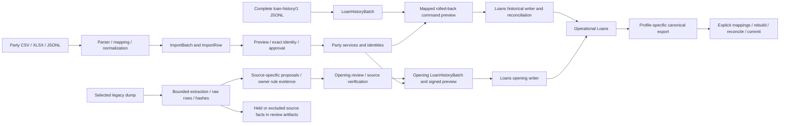

# Loans portability friction and historical fidelity

Companion to [the audit](loans-portability-audit.md). Current behavior is sourced
from the working implementation, not inferred from broad portability aspirations.

## Actual input and output paths

The Party spreadsheet machinery is implemented; a general Loans spreadsheet
mapper is not. Complete Loans import accepts a tightly specified financial
document, not a flat loan register. The legacy adapter builds source-specific
opening proposals, not arbitrary loan objects. The held/excluded branch retains
source material but is not an accepted, searchable historical-loan archive.

| Boundary | Current friction | Architectural reason |
| --- | --- | --- |
| Parser → staged Loans batch | Missing approval/event fields or unsupported keys fail before complete-history staging | Canonical input is already an evidence-complete dialect; it cannot represent uncertain external facts. |
| Raw legacy → proposal | Unsupported source columns/status/repledge/series type or incomplete collateral produce holds/exclusions | Source adapter deliberately recognizes only reviewed shapes/meanings; not a generic ORM loader. |
| Proposal → opening review | Unknown P/I/F, original terms, custody, or continuation fail reconciliation | Opening is an operational position, not mere source preservation. Correct gate for activation, insufficient archival destination. |
| Mapping → financial writer | Party must resolve exactly; licence/series/product must exist and match checks | Operational aggregate has mandatory reference graph; current setup also imposes source-date availability. |
| Complete history → persistence | Supplied disbursal/accrual/allocation/schedule must match supported calculations | Financial causal replay under Rokkad's supported policy is narrower than valid historical truth. |
| Opening → future operation | Full release/reversal supported; ordinary partial repayments, native accrual, renewal, auction blocked | ACTIVE means business state, not universal capability. Original history remains incomplete permanently. |
| Operational graph → export | Unsupported event kinds, concessions, storage/funding, unlinked accruals, bounds block export | Honest partial profile, not full archive. “Native” alone does not imply exportable. |
| Opening export → restore | Exact internal sections/fields, row ordering and ORM conversion, then semantic graph comparison | Strong present-day restoration safety but schema/graph coupling across versions. |

Sources: [Party parsers](../../apps/tenant_apps/data_portability/parsers.py),
[mapping](../../apps/tenant_apps/data_portability/mapping.py),
[loan_history](../../apps/tenant_apps/data_portability/loan_history.py),
[legacy_opening](../../apps/tenant_apps/data_portability/legacy_opening.py),
[history_import](../../apps/tenant_apps/loans/services/history_import.py),
[opening_import](../../apps/tenant_apps/loans/services/opening_import.py),
[opening_restore](../../apps/tenant_apps/loans/services/opening_restore.py).

## Released history without payments

Given L123, principal 100,000, loan date 2020-01-10, source status Released,
release date 2020-10-20, and no payment detail:

- **Current complete history:** cannot admit it. It needs evidenced original
  approval/disbursal, collateral, policy, chronological events, calculations,
  allocations, schedule and final settlement/custody reconciliation.
- **Current opening:** cannot admit it as an active opening. A closed source is
  not a current positive debt/custody position.
- **Fabricating events:** would falsely assert who did what, cash received,
  recognition, allocation and physical handoff details. Never do this.
- **Recommended:** accept the known source claim in immutable historical evidence.
  Keep principal meaning (“source original principal”), dates and original status.
  Mark repayment history and settlement breakdown unavailable. “Released” may
  suggest source closure but does not prove all fees, losses or custody details.
  It contributes to clearly labelled historical counts, not live receivables,
  repayment totals, new disbursal, or current vault inventory.

This is Option 3 with explicit evidence scope and admission separation. It is not
an unverified operational CLOSED row and not deletion of the facts. Reopening
such a historical record would require a separately reviewed current claim and
operational admission; a button must not reverse a nonexistent local release.

## Provenance inventory

| Provenance element | Present implementation | Gap/interpretation |
| --- | --- | --- |
| Installation/source identity | WorkspaceNamespace, SourceIdentity, HistoricalLoanImport source namespace/key | Namespace must survive dump refresh. Hash is snapshot identity, not loan identity. |
| Raw source | Party ImportRow.raw; offline selected records; source-bound opening verification wrapper | Complete-history batches keep normalized canonical documents, not arbitrary original vendor rows/bytes. |
| Source file/hash/row | Party source_name/SHA/row; dump hashes and scope fingerprints | Party source_sha256 hashes uploaded bytes; complete-history source_sha256 hashes canonical document; opening batch SHA identifies inner commit document. Same label has differing hash domains. |
| Mapping/normalization version | Party batch configuration, versioned presets/rules; legacy owner profile; mapping frozen in approval | No single Loans value-lineage format across source mapping, manual evidence and restore. |
| Original actor/date | Complete document actor strings/timestamps; opening source evidence; restore references.restore | Claims do not authenticate source users. Required actor strings in full profile cannot express true unknown cleanly. |
| Local import actor/time | HistoricalLoanImport.imported_by/imported_at; batch creator/commit attribution; local event recording fields | Correctly distinct from source actor. Do not present local import time as original transaction time. |
| Warnings/decisions | Party issues before/after, reviewed name collisions; opening codes and explicit evidence references | Opening review issues all ERROR; no shared missing-evidence/reconciliation vocabulary. |
| Source authentication | legacy_opening re-extracts selected source facts and binds review | Hash equality proves content equality; owner review is not independent documentary authentication. Restore retains claims without re-reading the dump. |
| Round-trip ancestry | Original opening/export/request preserved under references.restore | Recursive retained exports grow; 5 MiB is a real eventual ceiling. Need a bounded lineage strategy before repeated migrations are promised indefinitely. |

A future common claim should answer: value, semantic meaning, business date/as-of,
source namespace/snapshot/row/path, whether source-asserted or locally calculated,
mapping/calculation version, issue/uncertainty, and actual reviewer decision.
Unknown confidence should stay unknown; inventing numerical confidence scores adds
no evidence. Operators may append corrections with evidence/reason, never edit the
original source claim or silently “repair” an accepted financial event.

## Identity, collisions and live backfill

`PawnLoan.pk` is a local implementation key; `loan_number` is a Workspace-unique
display/lookup key; `HistoricalLoanImport.public_id` identifies accepted origin
evidence; source namespace + scoped source ID identifies the external loan.
Collateral has a UUID. Native export derives portable loan/event/actor identifiers
from the Workspace namespace and local identity. Source number is preserved even
when destination uses `H/<namespace>/<digest>`.

[import_identity.py](../../apps/tenant_apps/loans/services/import_identity.py) adds
legacy schema scope to source keys and recognizes earlier raw-key complete imports
without mutating them. Opening and complete history share financial-origin lookup.
An exact accepted retry is a no-op after authorization; changed source, mapping or
restoration conflicts. It is not synchronization or an update feed. A later dump
showing a previously active source loan released is therefore a reconciliation
problem, not permission to overwrite current operational debt.

Opening setup may explicitly propose the familiar local number. `_check_number`
checks existing local numbers and configured future ranges. The reviewed
`reserve_sequence_through` service advances counters under lock; it cannot rewind
them. Native draft creation consumes a number; historical import does not. New
lending can coexist with backfill when namespaces and numbering ranges are
coordinated. A source number that duplicates a native number remains a source alias
and receives a distinct local display number; never rename source evidence or
assume collision means same loan.

Current support for mixed Workspace populations:

| Population | Supported? |
| --- | --- |
| Native new loans | Yes, native workflow. |
| Active old loans with compatible complete history | Yes, explicit mappings/reconciliation; subsequent supported native servicing. |
| Active old loans with incomplete history | Only reviewed opening profile and its limited supported operations. |
| Closed old loans with complete compatible history | Yes, evidenced full-release profile. |
| Closed historical facts without that graph | No accepted historical archive path. |
| Incomplete reconciliation in progress | Staging/offline reports, not operational records or durable accepted archive. |
| Older source evidence appended after activation | No general history-merge/backfill writer; existing financial-origin conflict protects debt. |

## Time and financial meaning

| Value/time | Current behavior and risk | Required distinction |
| --- | --- | --- |
| created_at / imported_at | Generated when local rows are recorded; original actors/times in source envelope | Entry time versus business effective time; never backdate local creation to pretend a local action occurred. |
| loan_date | Native original date; opening retains original source date | Import date must not become original lending date. |
| effective_date / cutover | Events use business dates; opening disallows ordinary servicing on/before cutover | Preserve source/destination coverage and prevent double charging. |
| due_date / maturity / tenure | Obligations preserve/rebuild original dates; current opening enforces date-plus-months | Unknown or source-independent maturity must be held for activation rather than defaulted. Owner's jcl missing-term instruction is source-specific review evidence. |
| approval/return timestamps | Complete profile requires aware timestamps, nonfuture values, chronology | Unknown times cannot become midnight facts without explicit precision semantics. Complete importer compares date components in supplied offsets; it does not define a universal source business timezone. |
| historical window | Complete history cutover no later than today, at most 3,660 days after disbursal | Resource/capability bound can exclude legitimate older loans even without new financial activity. |
| rates | Approval freezes used quotes; current Rates correction lookup reflects current corrected knowledge | A fresh rate can estimate current metal value but cannot establish historical appraisal/LTV. |
| current appraisal | Dated append-only evidence; unknown opening value creates no appraisal | Preserve old assertion and new reviewed value simultaneously, with dates and authors. |
| recorded interest | Immutable recognition events plus opening interest | Do not replace with projected interest or contractual future interest. |
| source interest / outstanding | Legacy source fields may have different semantics from Rokkad fields | Keep source figure, source meaning, current calculation and reviewed admitted value separately. |
| monthly rate | Opening derives aggregate display rate from item economics; actual continuation uses named original rule | A matching aggregate percentage does not prove the same rounding, period or payment policy. |
| status | Source text versus local state and custody/financial evidence | “Released” does not prove a current-engine-calculated settlement amount. |

The [financial read-model contract](../domain/pawn-loan-financial-read-models.md)
already separates recorded debt, obligations, projected exposure and risk. Preserve
this separation when adding source assertions. Recalculation wins only for the
defined current operational question, never automatically for historical truth.

## Eight representative import cases

| Case | Current architecture | Proposed treatment and disposition |
| --- | --- | --- |
| 1. Perfect Rokkad-formatted loan | Complete profile accepts if exact shape/bounds/setup/calculations; opening file needs dedicated restore. A valid native loan outside supported features may still not export. | Detect declared profile; validate/reconcile; admit atomically. State exact coverage, preserve identities. “Rokkad” origin is not blanket compatibility. |
| 2. Active legacy with complete details | Admitted only if it matches complete supported policy and setup; details alone do not ensure calculator parity. | Retain source; complete restore if compatible, otherwise reviewed opening with source history retained as evidence. |
| 3. Active legacy with missing payments | Complete path rejects; reviewed opening may work. Current jcl adapter rejects source payment rows for unchanged-principal pilot. | Accept factual source evidence, reconcile actual P/I/F + continuation + obligations + custody; admit only supported future operations. Unknown balances remain review-only. |
| 4. Released historical without payments | No complete-history commit; cannot become active opening. Raw/report retention only. | Accept read-only historical claim with missing-evidence warnings; no fake payments, live debt, returned_at or local release event. |
| 5. External ID/display number conflicts with local number | Source namespace/key independent; deterministic historical number or checked explicit opening number; shared source identity catches retry/conflict. | Preserve alias, choose distinct local number, coordinate range reservation. Different source keys never merge by display number. |
| 6. Incomplete collateral | Native strict; opening permits unknown gross and unverified valuation, but needs net/purity/item allocation/custody; source incomplete-collateral selection excludes unsupported rows. | Archive exact description/aggregate claims; operational hold for unsupported detail. Do not invent item splits/purity. Review may later append actual measurements. |
| 7. Source outstanding differs from Rokkad calculation | Complete import rejects checkpoint; opening requires explicit reconciled balances and continuation. jcl pilot requires unchanged principal. | Preserve both figures with meanings/as-of and discrepancy. Reviewer selects a supported admission basis with evidence; no silent recalculation or adjustment event. |
| 8. Contradictory dates | Complete chronology rejects; opening review issues ERROR; no admission. | Parseable claims can be retained with HISTORICAL_INCONSISTENCY. Operational admission blocked where time affects debt/custody. Malformed/ambiguous dates retain raw text and unresolved parse, never guessed ISO dates. |

## Round-trip and exit guarantees

The implemented guarantee is bounded semantic restoration, not equality of database
IDs, local creation times, actors or all Workspace data. Complete history tests
prove exact document equality for supported imported examples and cross-Workspace
restoration. Opening restore compares a normalized semantic graph while retaining
source-local originals. It rebuilds supported events, not missing history.

For a genuine general archive, additionally preserve unknownness/precision,
source assertions and corrections, all source aliases and relationships,
currency/decimal/rounding semantics, calculation version, coverage boundaries,
evidence/media references or included bytes, tombstones, and unsupported known
facts. Explicit exclusions must distinguish financial restoration from full evidence
fidelity. Internal numeric IDs may occur in retained source evidence but must not
be the only stable relationship language of the portable contract.

Neither `party-bundle/1` nor the loan profiles form a complete Workspace archive.
Export before deletion remains unfinished architecture, and existing protected
evidence cannot be deleted through import cancellation. No proposed historical
acceptance should turn an archival assertion into current financial authority.
