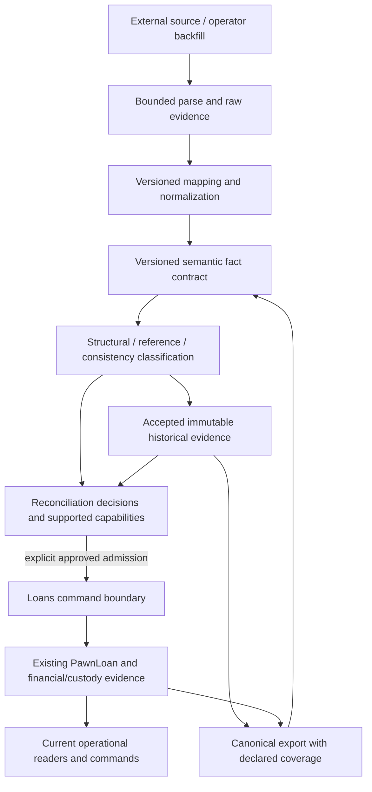

# Proposed Loans evidence and admission boundary

Derived from [the current audit](loans-portability-audit.md). This is the original
broader proposal. Selected owner-authorized implementations, including the bounded
historical-only archive, are recorded in the
[follow-up plan](../plans/loans-portability-audit-followup.md); later slices remain proposed.

## Alternatives

| Criterion | A: current domain plus exceptions | B: layered admission into existing domain | C: separate historical evidence and operational state | D: B + bounded durable evidence, existing operational Loans |
| --- | --- | --- | --- | --- |
| Conceptual clarity | Easy for a single pilot; degrades with exceptions | Clear input/readiness boundary | Strong truth/operation distinction | Strong distinction with small existing components |
| Implementation complexity | Low initially, rising per unknown/variant | Moderate; shared validation/admission interfaces | Moderate/high if all history duplicated | Moderate; reuse current staging and writers |
| Integrity | Risk of broad bypasses and nullable core | Strong if admission is exclusive | Strong if archive never feeds live balances implicitly | Strong; explicit financial-origin binding |
| Migration effort | Few targeted migrations, hidden accumulated costs | Can start without schema change | New historical store and links | One bounded evidence model later; no bulk conversion initially |
| Operational safety | Depends on scattered origin checks | Explicit operation prerequisites | Safe if historical queries kept distinct | Preserve current guards; unify capability report incrementally |
| Historical fidelity | Poor for outcome-only history | Poor if staging is only retention | High, including unknown/contradictory claims | High without rebuilding a second loan servicing system |
| Portability | Tied to current ORM exceptions | Better canonical boundary | Good evidence transport; restore still separate | Versioned semantics + existing restore translators |
| Testability | Expanding native/import exception combinations | Clear layer and admission tests | Clear historical/native tests, linking complexity | Layer tests plus explicit financial-origin exclusivity |
| Maintainability | Declines with each adapter | Good, but staging cancellation remains a gap | Poor if parallel full domain is created | Good if historical store remains evidence-only |
| Messy Excel/legacy | Requires increasingly exact mapping | Can classify/hold, not necessarily accept facts | Can preserve parseable claims | Can preserve claims and separately operationalize known position |
| Round-trip | Current limited profiles | Stable profile possible | Historical round-trip straightforward | Historical round-trip plus bounded operational restore |
| Native workflow | Accumulating conditional changes | Mostly untouched | Untouched unless states/readers mixed | Untouched; strict command ownership retained |

Alternative D is recommended. It is a pragmatic combination of B and C, not a new
framework. Full event sourcing, a parallel “legacy loan” operational application,
and a giant nullable PawnLoan all impose migration/maintenance costs without
evidence that they solve this boundary better.

## Proposed flow and owners

| Concern | Owner | Boundary |
| --- | --- | --- |
| Bytes/ZIP/XLSX/CSV/JSON parsing and resource limits | data_portability | No SQL execution from source; no domain writes. |
| Vendor mapping and normalization | source adapter in data_portability | Preserve raw source and versioned transformation; no invented source facts. |
| Canonical financial/loan meaning | Loans contract module | Explicit schema, values/unknownness, currency/time/precision, links and coverage independent of ORM. |
| Raw provenance/import job/approval envelope | data_portability | Workspace-owned staging and source receipt; source hash domain named. |
| Accepted loan historical evidence | Loans-owned evidence contract/store, exposed via portability flow | Durable source claim, never automatic receivable/custody authority. |
| Structural validation | parser + contract validator | Fail malformed/unsafe input; retain bounded raw diagnostics where safe. |
| Source consistency | contract/source adapter | Warnings/discrepancies distinguish known contradiction from missing evidence. |
| Identity resolution | small explicit Workspace-scoped resolver | Exact source keys; no borrower matching hidden in financial writer. |
| Reconciliation | Loans admission service using source claims + reviewer decisions | P/I/F, terms, continuation, obligations, custody and operation capability. |
| Operational validation/lifecycle | existing Loans commands/domain | No alternate generic model writer. |
| Persistence | existing ORM services, constraints, forced RLS | Historical and operational records have distinct contracts; no raw-SQL bypass. |
| Canonical export | domain-owned serializers + portability packaging | Frozen version-owned schema, explicit exclusions and restoration support. |

Do not introduce a plugin registry, arbitrary formula engine or configurable
workflow framework. The current source and opening profiles justify a small set
of explicit functions and versioned records.

## Three concepts, not necessarily three databases

1. **Operational state:** existing PawnLoan, items, policy, events and obligation/
   custody graphs. Preserve their current authority and protection.
2. **Historical evidence:** immutable facts asserted by a source, including
   original values, uncertainty, source status/date meaning and contradictions.
   Review decisions append without altering the original. Read-only does not mean
   unsearchable; authorized users should find a retained loan by source number.
3. **Portable contract:** stable semantic document representing the first two
   explicitly, with coverage and provenance. It is not ORM serialization.

Storage alternatives for (2):

| Option | Assessment |
| --- | --- |
| Keep only ImportRow/LoanHistoryBatch staging | Useful while editing/reviewing; cancellation clears source data and LoanHistoryBatch expects a valid specialized document. Not enough for accepted history. |
| Add JSON to PawnLoan | Still requires borrower/setup/positive terms and risks every operational selector seeing an unreconciled loan. Not recommended. |
| Add many nullable historical columns to PawnLoan | Inflates invalid combinations and scatters origin exceptions. Not recommended. |
| Durable immutable evidence record with indexed source identity and versioned bounded claim payload | Smallest suitable archive boundary. Can preserve unresolved Party/setup source references without fake operational dependencies. |
| Separate relational model for every possible legacy field | Premature without several demonstrated source contracts; unnecessary second domain. |

A future evidence record needs Workspace, stable source key/snapshot identity,
profile/version, original data or immutable source artifact reference/hash,
normalized assertions and recorded importer. A separate immutable admission link
can connect it to the existing financial origin when approved. Final table and
field names require an ADR; this proposal does not create them. Every new table
needs direct non-null Workspace ownership, forced RLS, registry and isolation tests.

Multiple snapshots of the same source loan can coexist as evidence revisions.
Only one accepted financial origin may initialize debt. Source-history snapshots
must never gain duplicate activation through a new filename or snapshot hash.

## Admission and operational capability

Admission is distinct from business state. Do not add IMPORTED, LEGACY,
INCOMPLETE or RECONCILED to PawnLoanState. Preserve permanent origin/evidence
coverage and derive permitted operations from supported contract, reconciled
facts, current state and normal authorization.

Before admission, records may be searched, inspected, exported as history and
given appended review decisions. They cannot receive payments, accrue interest,
release local collateral, renew or auction through live commands.

Minimum active opening admission for the presently supported operations:

- Exact source loan identity, source scope/coverage and explicit Workspace;
  resolve borrower and compatible destination setup without cross-Workspace links.
- Reviewed cutover/timezone and source/destination handover; P positive and
  I/F known/nonnegative; explain each amount's basis.
- Known original terms needed by the supported continuation, including billing
  anchor, reviewed rounding/basis and already covered interest.
- Remaining obligations with original due dates; principal reconciliation;
  distinguish recognized unpaid interest from projected future interest.
- Current collateral identity, custody and item-principal facts needed by supported
  servicing; unknown valuation can remain unknown if the operation does not use it.
- Immutable local review/approval, exact input hash, current authorization,
  replay/conflict checks, atomic graph reconciliation and supported capabilities.

An opening satisfying those facts remains limited to the operations actually
implemented. It does not become repayment/renewal/auction capable merely because
all review fields are populated. Conversely a read-only historical released claim
needs neither an operational interest engine nor current valuation.

“Fully reconciled” should not mean “indistinguishable from native.” Behavior can
converge for supported future operations, but origin and unavailable history remain
auditable permanently. Later evidence backfill may add knowledge without adding
financial events already represented by the opening. Admission correction/void is
a separately specified compensating operation, not deletion or source overwrite.

## Validation and issue semantics

Proposed issue shape: stable code, category, field/source path, rule version,
message, source/review evidence reference, and explicit blockers for historical
acceptance and each supported operational action. Severity is presentation; it
must not implicitly decide accounting readiness.

| Category | Example | Historical acceptance | Operational admission |
| --- | --- | --- | --- |
| Fatal structural/integrity error | Unsafe file, invalid namespace, foreign-Workspace local link | Reject unsafe representation | Reject |
| Mapping error | Ambiguous source status/metal/date convention | Retain raw bounded claim; unresolved mapping explicit | Block affected capability |
| Referential error | Party source key not yet mapped | Retain source reference | Block live debtor admission |
| Warning | Unusual but valid amount/date | Accept with issue | Review per rule |
| Historical inconsistency | Source release before source loan date | Retain both assertions and contradiction | Block operations depending on causal chronology |
| Missing evidence | Released date known, settlement detail absent | Accept historical claim | Do not fabricate operational release |
| Reconciliation required | Source balance differs from supported calculation | Accept source assertion | Hold until supported reviewed position established |
| Unsupported capability/profile | Repledged collateral or external auction surplus | Preserve evidence under explicit contract | Hold until operation implemented |

Current opening ERROR codes should first be classified without changing acceptance.
Only a later explicitly approved slice adds historical acceptance behavior.

## Import modes justified by existing code

- **Master data:** existing Party profiles; setup mapping is a separate dependency.
- **Active migration:** reviewed opening or evidenced compatible complete history;
  explicit cutover and minimum future servicing facts.
- **Historical archive:** needed because neither writer accepts released outcomes
  with unavailable event history. No financial posting.
- **Backfill:** a source entry method into the same evidence/admission boundary,
  not another business lifecycle. Human entry records actual entry time and source
  precision; cannot pretend to be native old origination.
- **Canonical re-import:** decode exact version/coverage; restore supported graphs
  with semantic reconciliation. Archive import preserves facts without replay.

## One improvement before more portability

Make **historical acceptance and operational admission explicitly different
outcomes**. First specify their evidence/readiness contract and characterize the
existing two writers; then add durable historical acceptance in a bounded slice.
This removes the pressure to manufacture histories or weaken native invariants.

F01 containment is the preceding security prerequisite: a new admission boundary
cannot be authoritative while generic financial model writes remain reachable.
Neither this proposal nor the audit authorizes starting that implementation.
