# SaaS Control-Plane Architecture Audit

This document preserves the August 2026 repository-based audit of Rokkad's
SaaS control plane after the migration from schema tenancy to shared-schema
PostgreSQL Row-Level Security (RLS).

It describes current implementation, reconstructed user flows, security and
architectural findings, a proposed target, and a phased improvement roadmap.
It is an audit and planning reference. Recommendations here are not accepted
architecture decisions unless separately recorded in an ADR.

No application behavior was changed as part of this audit.

Diagrams are embedded as repository-owned SVG files so they render in ordinary
Markdown viewers. Their Graphviz sources live in
`docs/architecture/diagrams/saas-control-plane/`. The original Mermaid source
is retained in expandable sections for convenient editing and reuse.

## A. Executive summary

The PostgreSQL RLS foundation is strong enough to support the application, but
the control plane is not yet coherent enough to become the unquestioned
foundation for every business application.

The central distinction is:

- Data isolation is comparatively mature. Workspace-owned models have direct
  ownership, PostgreSQL RLS is forced, the runtime role is restricted, and
  request cleanup is deliberate.
- Control-plane policy remains fragmented. Workspace resolution, ownership,
  authorization, subscription enforcement, entitlements, onboarding, billing,
  and navigation have overlapping implementations.

### Five highest-priority findings

1. **P0 — User-profile IDOR.** Unauthenticated callers can retrieve or update
   arbitrary profiles by primary key in `accounts/views.py`.
2. **P0 — Mutations exposed through GET.** Member removal and invitation
   revocation lack method restrictions in `apps/orgs/views.py`.
3. **P1 — Ownership has three competing representations.** `Company.owner`, an
   Owner membership, and `CompanyOwnership` can disagree. There is no atomic
   canonical ownership-transfer workflow.
4. **P1 — Billing is materially broken.** Payment creation, invoice output,
   email, and Razorpay code reference a nonexistent `Subscription.user`
   relationship. Webhook persistence and idempotency are not used.
5. **P1 — Workspace and subscription lifecycle are conflated.** Subscription
   failure can prevent Workspace context activation, while Workspace itself
   only has an `is_deleted` state.

The correct evolutionary direction is to retain RLS and the existing
control-plane service layer, then consolidate around:

- one request Workspace resolver;
- one RLS context mechanism;
- one canonical membership relationship;
- one atomic ownership-transfer service;
- one authorization policy interface;
- separate Workspace, billing, and entitlement state;
- one global/Workspace URL and UI convention.

## B. Control-plane boundary

### Control plane

The control plane owns identity, account security, Workspaces, domains,
memberships, roles, invitations, Workspace lifecycle, onboarding,
subscriptions, entitlements, billing administration, Workspace settings,
Workspace resolution, RLS context activation, platform administration,
control-plane audit, and control-plane navigation.

### Data plane

The data plane contains Party, Loans, Notify v2, Rates, and future
Workspace-owned business capabilities. These applications may consume a
validated control-plane context and policy interfaces. They must not resolve
Workspace identity, invent membership rules, implement subscription semantics,
or set PostgreSQL tenant context independently.

## C. Current architecture map

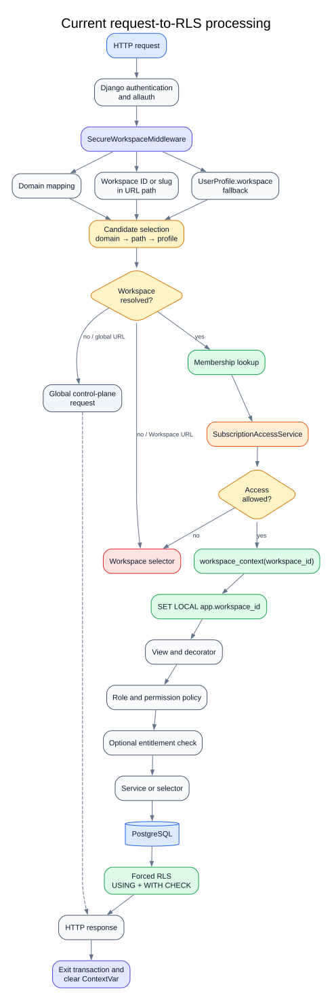

<details>
<summary>Editable Mermaid source</summary>

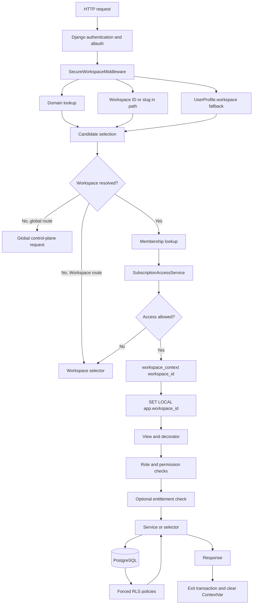

</details>

The important ordering defect is that subscription access is evaluated before
the RLS context is established. An expired or absent subscription can therefore
block entry to recovery-oriented control-plane pages such as billing.

### Current sources of truth

| Concern | Current source of truth | Enforcement point | Assessment |
| --- | --- | --- | --- |
| Authenticated user | Django `CustomUser`, session, allauth | Authentication middleware and decorators | Canonical |
| Current request Workspace | `request.workspace` | `SecureWorkspaceMiddleware` | Canonical in principle |
| Navigation preference | `UserProfile.workspace` | Middleware and profile helpers | Useful preference, overused as authority |
| Domain mapping | `Domain.tenant` | Workspace middleware | Canonical hostname mapping |
| Membership | `Membership(user, company)` | Middleware, decorators, services | Canonical model, duplicated lookups |
| Ownership | `Company.owner`, Owner membership, `CompanyOwnership` | Models, policy, views | Not canonical |
| Role | `Membership.role` | Helpers and direct role comparisons | Canonical data, inconsistent interpretation |
| Permissions | Hardcoded role defaults plus `Role.permissions` | Decorators, helpers, templates, views | Multiple mechanisms |
| Workspace operational state | `Company.is_deleted` | Managers, middleware, views | Incomplete |
| Subscription state | `Subscription.status` plus `is_active` | Access service and two middlewares | Duplicated state and enforcement |
| Entitlements | Plan booleans plus `SubscriptionEntitlement` | Model methods and access service | Competing sources |
| RLS context | PostgreSQL `app.workspace_id` | `workspace_context()` | Canonical |
| Data isolation | Forced PostgreSQL RLS | Database | Canonical and strong |

## D. Control-plane inventory

| Capability | Owning implementation | Important dependencies and coverage |
| --- | --- | --- |
| Identity/authentication | `accounts.CustomUser`, `UserProfile`, allauth | Orgs profile preference, allauth signals, auth smoke tests |
| Workspace management | `orgs.Company`, `Domain`, control-plane create/archive/restore services | Membership, subscription, preferences, audit |
| Workspace resolution | `SecureWorkspaceMiddleware`, `resolve_request_workspace` | Domain, membership, subscription access, RLS; extensive middleware tests |
| RLS activation | `apps.tenancy.context`, `WorkspaceOwnedModel`, RLS operations/checks | Restricted runtime role and adversarial per-app tests |
| Workspace switching | `workspace_selector`, `workspace_select`, account aliases, switcher partials | `UserProfile.workspace`, route and denial tests |
| Membership/team | `Membership`, `Role`, membership services, role policy | Seat capacity, permissions, audit; substantial unit coverage |
| Ownership | `Company.owner`, Owner membership, `CompanyOwnership` | Partial role-policy protection; no complete transfer flow |
| Invitations | `CompanyInvitation`, `PendingInvitation`, services, views, signals | django-invitations, allauth, email, seat limits |
| RBAC | `permissions.py`, `decorators_v2.py`, `role_policy.py`, Django permissions, Guardian | Templates and business-app access helpers |
| Subscription | `Plan`, `Subscription`, `BillingAccount` | Workspace, membership, Razorpay; mostly decision-level tests |
| Entitlements | Plan flags, `SubscriptionEntitlement`, `SubscriptionAccessService` | Middleware, module registry, seat enforcement |
| Billing | `Invoice`, `Payment`, `UsageMetrics`, `PriceOverride`, Razorpay service/webhook | Contains invalid `subscription.user` assumptions |
| Onboarding | `OnboardingProgress`, `OnboardingChoice`, `WorkspaceSetupState`, step views | Workspace creation, invitations, audit |
| Workspace settings | Configuration app and Workspace settings views/templates | Resolution, permissions, setup checklist |
| Audit | `orgs.AuditLog` and inline service/view logging | Global records related to users and Workspaces |
| Navigation/UI | Public, auth, global, tenant, Workspace-settings and management layouts | Context processors and two Workspace notions |
| Platform administration | Django superuser as platform administrator | Membership bypass; RLS still requires an effective Workspace |
| Background operations | Business-specific tasks and commands | Must explicitly enter `workspace_context`; no universal wrapper |

The authoritative RLS registry protects Party, Loans, Notify v2, and Rates.

## E. Current user flows

### Signup

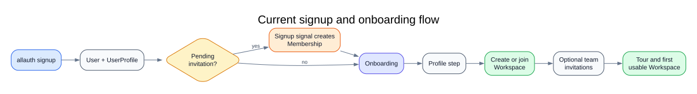

<details>
<summary>Editable Mermaid source</summary>

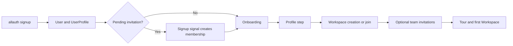

</details>

Global email verification is optional. Direct invitation acceptance applies a
verified-email check, while pending-invitation consumption during signup does
not apply the same rule.

### Login

Allauth authenticates, redirects to `home`, and `onboarding_required` decides
whether the user continues onboarding or proceeds toward Workspace setup. A
profile preference may silently become the candidate Workspace on non-exempt
routes.

### Workspace creation

```text
Workspace form
→ control_plane.create_workspace_from_form
→ atomic Company + Domain + Owner membership
→ audit
→ set UserProfile.workspace
→ Workspace dashboard/settings
```

Core writes are sensibly atomic. Domain construction and `schema_name`
terminology remain transitional.

### Workspace selection and switching

```text
GET selector
→ list valid memberships
→ possibly auto-redirect to profile preference
→ GET workspace_select/<id>
→ membership/subscription validation
→ persist profile preference
→ redirect
```

Domain, path, and profile preference can all select a Workspace. Their priority
is domain, then explicit path, then profile. Selection is account-persistent,
not session- or tab-local. Tabs can race the preference, although an explicit
path/domain still receives its own RLS context.

### Invitation creation and acceptance

Creation checks permission, grant policy, and seat limit before creating and
sending a `CompanyInvitation`. Onboarding sends external email while a broader
database transaction is open.

Acceptance has three overlapping paths:

1. authenticated custom acceptance view;
2. django-invitations `invite_accepted` signal;
3. `PendingInvitation` consumed by `user_signed_up`.

The custom path checks email identity and seat capacity. Signal paths differ in
verification and failure behavior.

### Team changes

Role change resolves Workspace and membership, applies role policy, mutates the
membership in a transaction, and audits the change. Member removal follows the
same pattern and clears a stale profile preference. The service boundary is
reasonable, but member removal is not POST-only.

### Ownership transfer

No complete supported flow exists. `CompanyOwnership.transfer_ownership()`
changes ownership-history rows but does not atomically synchronize
`Company.owner` and Owner membership.

### Subscription and billing

The intended path is plan selection, checkout, Razorpay signature verification,
subscription activation, invoice/payment update, and confirmation email. The
current payment path fails because it queries nonexistent `Subscription.user`.
Cancellation fields exist, but no complete cancellation workflow was found.

### Workspace suspension, archive, and restore

No explicit suspension state exists. Archive/restore toggles `is_deleted`.
Subscription denial behaves like suspension but is not a Workspace lifecycle
transition.

### Logout

Allauth redirects to `home`. `UserProfile.workspace` persists across sessions
and devices until changed.

## F. Architecture findings

| ID | Severity | Area | Current behavior and problem | Recommendation |
| --- | --- | --- | --- | --- |
| CP-01 | P0 | Account security | Profile detail/update accept arbitrary PKs without authentication or ownership checks. | Restrict to authenticated self-service or a separately authorized admin operation. |
| CP-02 | P0 | HTTP security | Member removal and invitation revocation are not POST-only. | Require mutation methods, CSRF, service authorization, and direct-endpoint tests. |
| CP-03 | P1 | Ownership | Three owner representations can disagree. | Choose one canonical representation and implement one locked transfer service. |
| CP-04 | P1 | Billing | Payment activation queries `Subscription.user`; subscriptions are company-owned. | Rebuild activation as an idempotent Workspace subscription command. |
| CP-05 | P1 | Billing | Razorpay order, PDF, and email code reference nonexistent `subscription.user`. | Resolve the billing contact through `BillingAccount` or explicit billing administration. |
| CP-06 | P1 | Webhooks | `ProviderWebhookEvent` exists but callbacks are not persisted or deduplicated. | Persist by provider event ID and process idempotently in a transaction. |
| CP-07 | P1 | Lifecycle | Workspace has only `is_deleted`; trial, suspension, past-due, archive, and deletion are conflated or undefined. | Introduce an operational lifecycle independent of billing. |
| CP-08 | P1 | Recovery access | Middleware rejects inactive subscription before entering Workspace context. | Establish membership/context first; apply capability-specific policies afterward. |
| CP-09 | P1 | Subscription | `status` and `is_active` overlap; trial expiry updates only when the model is saved. | Define a transition service and derived effective billing state. |
| CP-10 | P1 | Entitlements | Plan flags, model methods, entitlement rows, and module metadata compete; missing rows allow access. | Establish one fail-closed entitlement policy and stable feature codes. |
| CP-11 | P1 | Invitations | Signup-signal membership creation does not enforce the same verified-email rule as direct acceptance. | Use one invitation-acceptance command after verified identity. |
| CP-12 | P1 | Archive | Archive fallback assumes a synthetic `schema_name="public"` Workspace row. | Clear preference and return to the global selector. |
| CP-13 | P1 | Referential safety | `Company.owner` uses cascade deletion. | Use protected/null-safe semantics and an explicit account-deletion policy. |
| CP-14 | P1 | Transactions | Invitation email is sent inside a transaction. | Commit records first, then dispatch through `transaction.on_commit`. |
| CP-15 | P1 | Domain identity | `Domain.is_primary` lacks a clear one-primary-domain-per-Workspace constraint. | Add a conditional unique invariant and domain-management service. |
| CP-16 | P2 | Resolution | Domain, path, profile, request aliases, and context-processor fallback compete. | Treat profile only as a navigation default. |
| CP-17 | P2 | Authorization | Hardcoded permissions, DB permissions, Guardian, direct role comparisons, helpers, and template checks coexist. | Standardize on one Workspace policy API. |
| CP-18 | P2 | Subscription | Two middlewares, decorators, and billing mixins enforce divergent rules. | Replace route-wide duplication with capability policies. |
| CP-19 | P2 | Context clarity | Global pages can display profile Workspace data while request/DB context is empty. | Keep global layouts context-free unless a Workspace is explicit. |
| CP-20 | P2 | Switching | Selection and clearing mutate persistent state through GET; tabs race one preference. | Use POST; let explicit URLs determine each request. |
| CP-21 | P2 | Services | Invitation acceptance exists in views, services, and signals with different semantics. | Route all paths through one idempotent command. |
| CP-22 | P2 | UI | Multiple shells, duplicate switchers, legacy names, and profile-derived labels obscure context. | Define one global shell and one Workspace shell. |
| CP-23 | P2 | URLs | `/app`, `/orgs`, `/workspace`, `/w`, domain, and unscoped business routes coexist. | Publish one canonical route for each capability. |
| CP-24 | P3 | Legacy | `tenant_urls`, `tenant_apps`, `request.tenant`, `schema_name`, and schema wording remain. | Migrate terminology after behavior is locked. |
| CP-25 | P3 | Stale policy/UI | Retired DEA, accounting, Girvi, Contact, Sales, and Purchase concepts remain in permission/onboarding surfaces. | Remove after checking persisted assignments. |

### Concrete evidence locations

- Profile IDOR: `accounts/views.py`, `userprofile_detail` and
  `userprofile_update`.
- Request resolution and subscription-before-context ordering:
  `apps/orgs/middleware_v2.py`.
- RLS context: `apps/tenancy/context.py`.
- Forced policy operation: `apps/tenancy/rls.py`.
- Ownership representations: `apps/orgs/models.py`.
- Team/invitation mutation views: `apps/orgs/views.py`.
- Control-plane mutation services: `apps/orgs/services/control_plane.py`.
- Competing RBAC: `apps/orgs/permissions.py`, `decorators_v2.py`, and
  `templatetags/orgs_tags.py`.
- Subscription state and entitlements: `apps/subscriptions/models.py` and
  `services.py`.
- Broken billing paths: `apps/subscriptions/views.py` and
  `razorpay_service.py`.
- Invitation signal paths: `apps/orgs/signals.py`.

## G. Security invariant matrix

| Invariant | DB | Middleware/context | Service/view | Coverage |
| --- | --- | --- | --- | --- |
| Workspace rows cannot cross the RLS boundary | Forced `USING/WITH CHECK` | Context set per request | Model save guards | Strong adversarial tests |
| No context exposes no business rows | RLS policy | Empty context | N/A | Strong |
| Membership is checked before RLS activation | Membership uniqueness | Yes | Repeated later | Strong |
| Context clears after response/exception | Transaction-local setting | Explicit cleanup | N/A | Covered |
| Removed members immediately lose access | Membership deletion | Revalidated next request | Removal service | Covered |
| One membership per user/Workspace | Unique constraint | N/A | Creation service | Covered |
| Every active Workspace has an owner | No complete invariant | No | Partial policy | Missing |
| Owner FK and Owner membership agree | No | No | No synchronizer | Missing |
| Last owner cannot leave or be demoted | No DB constraint | No | Count-based policy | Unit coverage; concurrency missing |
| Ownership transfer is atomic | No | No | No complete command | Missing |
| Archived Workspace cannot activate | Flag and filtered manager | Path resolution excludes it | Archive service | Reasonable |
| Suspended Workspace cannot operate | No state | No explicit state | Subscription substitutes | Missing |
| Subscription changes are idempotent | Partial uniqueness | Duplicate enforcement | Broken payment path | Missing |
| Webhook is authenticated | N/A | N/A | HMAC verification | Replay/idempotency missing |
| Invitation belongs to verified identity | Partial constraints | N/A | Direct path only | Inconsistent |
| Invitation acceptance and membership are atomic | Constraints | N/A | Direct service; signal alternatives | Partial |
| Mutations require safe HTTP methods | N/A | CSRF middleware | Several view violations | Missing |
| Object IDs cannot forge access | RLS for data plane | Resolver | Profile endpoints fail | Critical gap |
| Entitlement denial is fail-closed | No | Some middleware | Missing row allows | Decision tests only |
| Jobs have explicit Workspace context | RLS fails closed | No request middleware | Manual convention | Per-app only |

## H. Duplication and drift

| Concern | Competing implementations | Proposed canonical implementation |
| --- | --- | --- |
| Current Workspace | Domain, path, profile, `request.workspace`, `request.tenant`, context fallback | Explicit request identity produces `request.workspace`; profile is only a default |
| Switching | Selector, account alias, clear/reset aliases, middleware synchronization | One POST selection command plus canonical redirect |
| Context activation | `workspace_context`, request aliases, compatibility helpers | `apps.tenancy.workspace_context` only |
| Membership | Middleware, decorators, assertion helpers, billing mixin, app helpers | Reusable `WorkspaceAccess` produced once and revalidated by mutation services |
| Permissions | Role names, hardcoded maps, Django permissions, Guardian, templates | One Workspace policy service |
| Ownership | Owner FK, Owner role, ownership history | One canonical relationship and one transfer command |
| Subscription | Two middlewares, decorators, mixins, model methods | Capability-level subscription policy |
| Entitlements | Plan booleans, rows, module registry | Stable feature-code entitlement service |
| Invitations | View/service, accepted signal, signup signal | One idempotent acceptance command |
| Workspace creation | Standard and onboarding wrappers | One creation command with onboarding adapter |
| URLs | `/app`, `/orgs`, `/workspace`, `/w`, domain, unscoped roots | One global and one Workspace namespace |
| UI shells | Public/auth/global/tenant/settings/management bases | Global shell and Workspace shell |
| Side effects | Models, views, services, signals | Structured audit in transaction; external work after commit |

## I. `django-tenants` residue

| Residue | Classification | Direction |
| --- | --- | --- |
| Package/backend/router/middleware | Remove if found in dependency tooling | Not part of runtime architecture |
| `tenant_urls.py` | Migrate | Active URLConf with obsolete name |
| `apps/tenant_apps/` package | Retain intentionally short-term | Renaming creates high import churn with little safety gain |
| `SHARED_APPS` / `TENANT_APPS` names | Migrate | Now ordinary installed-app groupings |
| `Company.schema_name` as slug | Migrate | Introduce immutable `slug` |
| `request.tenant` | Transitional | Remove after callers use `request.workspace` |
| `tenant_context.py` name | Migrate | It resolves Workspace, not schema |
| Schema provisioning no-ops | Remove | Compatibility only |
| Synthetic public Workspace assumptions | Remove | Global context means no active Workspace |
| Retired app route tombstones | Retain temporarily or remove by policy | Useful only for a defined compatibility period |
| Schema wording in UI | Remove | Misleading |
| Schema-era runbooks | Migrate or archive | Must not prescribe retired commands |
| Historical audits | Retain as history | Mark superseded/current status clearly |
| `Domain.tenant` field name | Migrate later | Functionally valid but stale terminology |
| Legacy retired templates | Investigate/remove | Likely detached from supported applications |

No active `TenantMixin`, `DomainMixin`, `TenantMainMiddleware`, or PostgreSQL
schema switching was found in the current runtime. Remaining residue is mostly
terminology, routing compatibility, documentation, and package naming.

## J. UI and URL audit

### Current problems

- Global pages can appear Workspace-aware through profile fallback.
- Workspace settings, team, billing, and business pages use multiple shells.
- Desktop and mobile switchers duplicate markup.
- Workspace switching is a GET action with persistent consequences.
- Archived pages expose schema terminology.
- Some templates use `request.user.profile.workspace` instead of the actual
  request Workspace.
- Direct HTMX endpoints do not consistently have the same method guarantees as
  their visible controls.
- Owner-only billing UI conflicts with the model's billing-admin concept.
- Cancellation, transfer, suspension, and billing-recovery experiences are
  incomplete.
- Multiple URL families obscure global versus Workspace context.

### Proposed information architecture

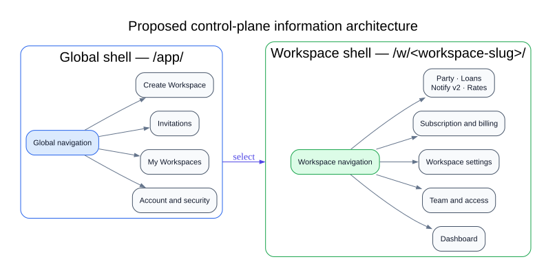

<details>
<summary>Editable Mermaid source</summary>

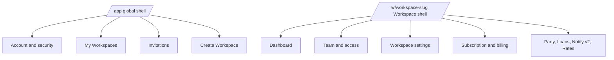

</details>

Suggested canonical routes:

```text
/app/account/...
/app/workspaces/
/app/workspaces/new/
/app/invitations/

/w/<workspace-slug>/
/w/<workspace-slug>/team/
/w/<workspace-slug>/settings/
/w/<workspace-slug>/billing/
/w/<workspace-slug>/party/
/w/<workspace-slug>/loans/
/w/<workspace-slug>/notify/
/w/<workspace-slug>/rates/
```

Custom Workspace domains can remain aliases, but hostname and path identity
must never disagree. HTMX changes rendering, not security semantics.

## K. Proposed target architecture

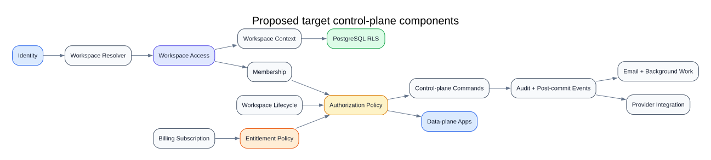

<details>
<summary>Editable Mermaid source</summary>

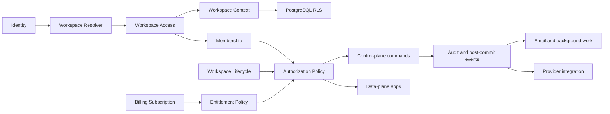

</details>

### Component responsibilities

| Component | Responsibility | Must not do |
| --- | --- | --- |
| Identity | Authentication, profile, account security | Select Workspace or grant Workspace permission |
| Workspace | Stable identity and metadata | Encode billing status as identity |
| Resolver | Convert explicit request identity into one Workspace | Infer authorization from profile preference |
| Context | Set request and PostgreSQL RLS context and guarantee cleanup | Determine roles or entitlements |
| Membership | Canonical User-to-Workspace relationship and role | Represent subscription or isolation |
| Authorization policy | Decide whether a member may perform an action | Substitute for RLS |
| Workspace lifecycle | Enforce operational transitions | Treat trial or plan as operational identity |
| Subscription | Record commercial and provider lifecycle | Decide every app capability directly |
| Entitlements | Answer whether a feature or limit is enabled | Process provider payments |
| Invitation | Pending intent to create membership after verified acceptance | Become a second permanent membership model |
| Commands | Mutate state atomically and enforce invariants | Depend on UI presentation |
| Selectors | Read state without side effects | Activate Workspace implicitly |
| Events/audit | Record completed changes and trigger post-commit effects | Carry core transaction correctness |
| UI | Present context and commands consistently | Invent authorization rules |

### Proposed lifecycle separation

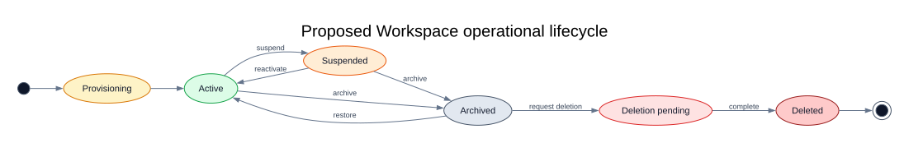

<details>
<summary>Editable Mermaid source</summary>

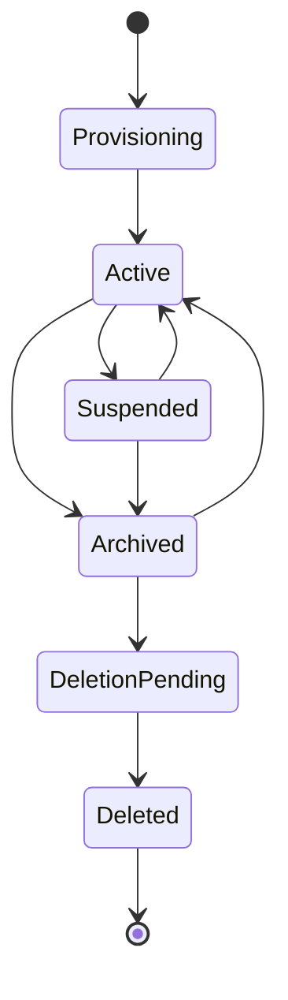

</details>

Billing remains a separate state machine:

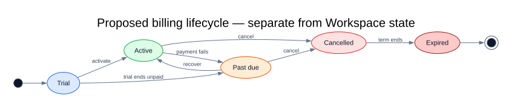

<details>
<summary>Editable Mermaid source</summary>

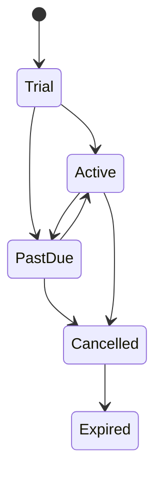

</details>

Policy combines the two deliberately. Past due may block business mutation but
must still allow billing recovery and controlled export. Archived blocks
ordinary business operations regardless of subscription state.

## L. Control-plane to data-plane contract

Every business application may assume:

1. `request.user` is authenticated where required.
2. `request.workspace` is either a validated `Company` or `None`.
3. A non-null request Workspace has passed membership validation unless the
   actor is an explicitly identified platform administrator.
4. PostgreSQL `app.workspace_id` matches `request.workspace.id`.
5. RLS context remains active for the request and is cleared afterward.
6. Workspace operational state has been evaluated.
7. Authorization is requested through one Workspace policy interface.
8. Feature access and limits are requested through one entitlement interface.
9. Workspace-owned models implement the canonical RLS ownership contract.
10. Services may accept Workspace/access context but never infer it from
    `UserProfile.workspace`.
11. Jobs receive an explicit immutable `workspace_id` and enter
    `workspace_context(workspace_id)`.
12. Missing or wrong context fails closed.
13. Cross-Workspace foreign-key assignments are invalid.
14. URL object IDs never substitute for Workspace scoping.
15. Platform-admin application authority does not imply RLS bypass.

Conceptual interfaces:

```python
workspace = request.workspace
access = request.workspace_access

access.require("loans.repayment.create")
entitlements.require(workspace, "loans")
entitlements.limit(workspace, "max_users")

with workspace_context(workspace_id):
    run_workspace_job(...)
```

Business apps must not read the profile preference as active context, set
PostgreSQL settings directly, compare plan names, recreate membership logic,
rely only on query filtering, or silently fall back to another Workspace.

## M. Project-wide standards

### Models and RLS

- Every Workspace-owned concrete model has a non-null `workspace` FK.
- Use the canonical Workspace-owned base or an explicitly audited equivalent.
- Force RLS with identical `USING` and `WITH CHECK` ownership predicates.
- Ownership is immutable except through a dedicated transfer command.
- Cross-Workspace relationships receive application and database protection.
- Global tables must not hide Workspace-owned business records.

### Services, selectors, and events

- Commands own mutations, policy checks, and transactions.
- Selectors are side-effect-free reads.
- Views parse HTTP input and delegate.
- Forms validate input, not lifecycle orchestration.
- Signals do not create alternative transactions.
- External effects execute after commit.

### Authorization order

```text
authentication
→ Workspace resolution
→ membership
→ operational-state policy
→ action authorization
→ subscription entitlement
→ RLS-backed data access
```

Each layer answers one question and does not substitute for another.

### HTTP and UI

- Global routes use `/app/...`.
- Workspace routes use one explicit Workspace namespace or an authoritative
  mapped domain.
- Mutations require POST, PATCH, or DELETE and CSRF.
- Object queries include their Workspace relationship even with RLS.
- HTMX and full-page endpoints use identical policy checks.
- Templates use `request.workspace`, never profile preference, as active
  context.
- Global and Workspace shells have consistent empty, denied, suspended,
  archived, and billing-recovery states.

### Jobs and transactions

- Job payloads contain `workspace_id`, never schema name.
- Jobs enter `workspace_context` before protected queries.
- No context is an error, not a global-processing mode.
- Retryable commands and provider callbacks are idempotent.
- Workspace creation, invitation acceptance, ownership transfer, last-owner
  changes, subscription/payment changes, and lifecycle transitions are atomic.
- Audit records are stored with the command; external effects use
  `transaction.on_commit` or an outbox.

### Testing

Every Workspace capability should test no context, correct context, wrong
context, raw SQL, spoofed writes, removed membership, forged URLs, direct
endpoint access, permission and entitlement denial, rollback, relevant
concurrency, job execution without context, and platform-admin behavior.

## N. Recommended change classification

### Keep

- Forced PostgreSQL RLS and the restricted runtime role.
- Transaction-local `workspace_context()`.
- Direct Workspace ownership and the central RLS registry/checks.
- Membership validation before ordinary Workspace access.
- The control-plane service module as mutation boundary.
- Last-owner policy intent, invitation lifecycle, seat limits, domain/path
  mismatch protection, and adversarial RLS tests.

### Consolidate

- Workspace resolution around `request.workspace`.
- Membership/permission checks behind one access policy.
- Invitation acceptance and Workspace creation commands.
- Subscription and entitlement enforcement.
- Workspace switching, layouts, switcher partials, and audit-event production.

### Refactor

- Ownership and transfer.
- Workspace lifecycle.
- Billing activation, invoice generation, and provider integration.
- Subscription state transitions.
- Verified invitation onboarding.
- Profile-fallback context processors.
- Domain primary invariants and post-commit side effects.

### Remove

- Unsafe profile behavior.
- GET-based mutations.
- Duplicate subscription middleware.
- Synthetic public-Workspace assumptions.
- Schema compatibility no-ops and stale terminology.
- Retired permissions, onboarding choices, navigation, and obsolete backup
  views after confirming no consumer.

### Introduce

- Explicit Workspace operational state.
- Atomic ownership transfer.
- Canonical `WorkspaceAccess` authorization policy.
- Canonical entitlement policy.
- Billing transition service and idempotent webhook processing.
- Post-commit event/outbox convention.
- Immutable Workspace slug.
- Global/Workspace route and layout contracts.
- Concurrency tests for last-owner and seat-limit operations.

## O. Phased implementation roadmap

### Phase 0 — Close immediate security gaps

- Protect profile endpoints.
- Require safe mutation methods and CSRF.
- Add anonymous, IDOR, GET-rejection, CSRF, and direct-POST tests.
- Completion: no control-plane mutation is possible through GET and profiles
  are self/admin scoped.

### Phase 1 — Lock context and resolution contracts

- Make `request.workspace` the sole active request context.
- Make profile Workspace a navigation preference only.
- Cover domain/path/profile precedence, public requests, direct URLs, removed
  membership, tab behavior, and cleanup.

### Phase 2 — Consolidate membership, ownership, and RBAC

- Choose canonical ownership.
- Add an atomic locked transfer command.
- Replace direct role checks and template permission mechanisms.
- Add concurrency and privilege-escalation tests.

### Phase 3 — Introduce Workspace lifecycle

- Add explicit operational state and guarded transitions.
- Remove public-Workspace archive fallback.
- Test every legal and illegal transition and recovery path.

### Phase 4 — Repair subscription, billing, and entitlements

- Fix company-owned billing assumptions.
- Define transition services.
- Persist and deduplicate provider callbacks.
- Consolidate feature codes and remove duplicate middleware.
- Test replay, duplicate payment, rollback, renewal, cancellation, past-due
  recovery, grace policy, and entitlement outcomes.

### Phase 5 — Consolidate invitation and onboarding flows

- Route all membership acceptance through one verified idempotent command.
- Test new and existing users, wrong/unverified email, expiry, retry, and seat
  races.

### Phase 6 — Standardize URLs and control-plane UI

- Establish global and Workspace shells and canonical routes.
- Preserve temporary compatibility redirects only where justified.
- Test navigation, HTMX parity, and denied/empty states.

### Phase 7 — Remove tenancy and retired-app residue

- Retire obsolete settings names, helpers, templates, permissions, route names,
  and current documentation guidance.
- Preserve clearly marked historical evidence.

### Phase 8 — Establish contract tests

- Add shared CI gates for ownership, RLS metadata, runtime role, resolver,
  authorization, entitlement, and background-job contracts.
- Completion: a nonconforming Workspace app fails CI.

### Phase 9 — Begin data-plane audit

- Audit Party, Loans, Notify v2, and Rates against the accepted control-plane
  contract.
- Do not require each app to reinterpret Workspace, permission, or subscription
  rules.

## P. Direct answers

1. **Foundation readiness:** RLS is ready; the wider control plane needs its
   immediate security, ownership, resolver, and authorization gaps closed.
2. **Highest risks:** Profile IDOR, GET mutations, unsafe ownership, broken
   billing, non-idempotent webhooks, divergent invitation acceptance, and
   conflated Workspace/subscription access.
3. **Responsibility separation:** RLS is separated from authorization, but
   membership, authorization, and subscription still overlap.
4. **Canonical resolver:** A primary middleware exists, but profile fallback
   and helper/context-processor behavior create competing authority.
5. **Canonical context:** Yes, `apps.tenancy.workspace_context`; legacy aliases
   and names should be retired.
6. **RLS boundary:** Correctly designed through forced policies, restricted
   runtime role, transaction-local context, and adversarial tests. Jobs and
   commands need a universal contract.
7. **Legacy residue:** Runtime schema tenancy is gone; terminology, URLs,
   package names, compatibility helpers, and stale documents remain.
8. **Workspace lifecycle:** Not explicit or complete.
9. **Ownership:** Not safely canonical or atomically transferable.
10. **RBAC:** The core data is usable, but enforcement is inconsistent.
11. **Subscription/entitlements:** Separate models exist, but runtime behavior
    still mixes plan flags, rows, and route-wide blocking.
12. **UI coherence:** Partial; global/Workspace context, URL hierarchy,
    lifecycle recovery, and terminology need consolidation.
13. **Mandatory patterns:** Explicit request Workspace, canonical context,
    forced RLS, direct ownership, one policy API, one entitlement API,
    service-owned transactions, safe methods, post-commit effects, and
    adversarial tests.
14. **Business-app contract:** Consume validated `request.workspace`, use RLS
    ownership and central policy APIs, carry explicit Workspace IDs into jobs,
    and fail closed without context.
15. **Before data-plane audit:** Close P0 endpoints and settle canonical
    Workspace resolution, ownership, authorization, and entitlement contracts.

## Audit status

This document reconstructs repository behavior through static inspection of
settings, middleware, models, services, selectors, forms, views, decorators,
permissions, signals, templates, URLs, tests, commands, and billing integration.
It intentionally records both strengths and defects. Recommendations require
separate approval and implementation planning before they become architecture.
