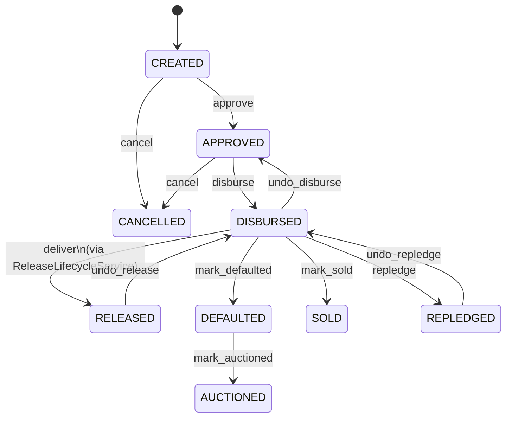
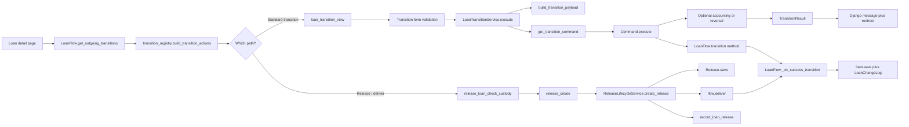
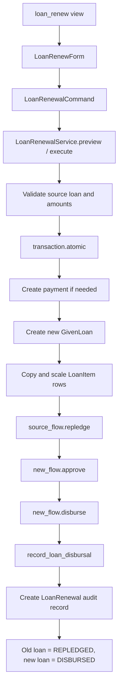

---
status: archived
owner: project
updated: 2026-06-17
tags: [archive]
related: []
---

# Girvi Lifecycle Execution Reference

Date: 2026-04-02  
Scope: `GivenLoan` lifecycle after the Phase 2 registry/command/service refactor.

---

## Purpose

This document explains **how the Girvi lifecycle executes at runtime**, step by step, and shows:

- where the lifecycle is defined,
- where services are used,
- where the command pattern is used,
- how transitions move from UI → view → service → command → flow → accounting/audit,
- how each important action (`create`, `approve`, `cancel`, `disburse`, `release/deliver`, `repledge`, `auction`, `sell`, undo actions) is executed.

This is intended as a **reference guide** for future debugging and feature work.

For the concise canonical transition contract, see `GIVENLOAN_STATUS_TRANSITION_CONTRACT.md`.

---

## 1) The key idea after Phase 2

After the Phase 2 cleanup, the lifecycle is now split into clear layers:

| Layer | Main files | Responsibility |
|---|---|---|
| **FSM / legal state movement** | `apps/tenant_apps/girvi/flows.py` | Defines which status transitions are legal |
| **Transition wiring** | `apps/tenant_apps/girvi/transition_registry.py` | Maps transition key → form class → payload DTO → command class → UI metadata |
| **Transition command execution** | `apps/tenant_apps/girvi/transitions/commands.py` | Executes each transition with the correct behavior (generic, atomic, warning, reversal) |
| **Application services** | `apps/tenant_apps/girvi/service_modules/*.py` | Orchestrates higher-level workflows like release creation and renewal |
| **HTTP entrypoints** | `apps/tenant_apps/girvi/views/loan.py`, `views/release.py`, `views/custody_views.py` | Accept request, bind form, call service, show message, redirect |
| **Persistence / document model** | `apps/tenant_apps/girvi/models/release.py` | Saves business documents like `Release` |
| **Accounting side-effects** | `apps/tenant_apps/girvi/payment_service.py` | Posts/reverses vouchers for disbursal and release |
| **Audit trail** | `LoanFlow._on_success_transition()` in `flows.py` | Saves status and writes `LoanChangeLog` |

### Practical rule

- **`LoanFlow`** decides **what is legal**.
- **`transition_registry.py`** decides **how the app wires it**.
- **Command classes** decide **how it executes**.
- **Services** orchestrate multi-step business operations.

---

## 2) What Phase 2 changed

Phase 2 made the lifecycle more explicit and predictable:

1. **Transition routing was centralized** in `transition_registry.py`.
2. **Typed payload DTOs** were introduced in `transitions/payloads.py`.
3. **`LoanTransitionService`** now delegates to **command classes** instead of branching inline.
4. **Release creation** was moved out of `Release.save()` side-effects into **`ReleaseLifecycleService`**.
5. Core service responsibilities were extracted into:
   - `service_modules/id_generation.py`
   - `service_modules/release_lifecycle.py`
   - `service_modules/transitions.py`
   - `service_modules/renewal.py`
6. `services.py` now acts mainly as a **compatibility facade / re-export surface**.

---

## 3) Lifecycle states and legal transitions

The main `GivenLoan` state path now looks like this:

```text
CREATED ──approve──► APPROVED ──disburse──► DISBURSED ──deliver──► RELEASED
   │                         │                    │
   └──────cancel────────────► CANCELLED          ├──mark_defaulted──► DEFAULTED ──mark_auctioned──► AUCTIONED
                                                 ├──mark_sold────────► SOLD
                                                 ├──repledge─────────► REPLEDGED ──undo_repledge──► DISBURSED
                                                 └──undo_disburse────► APPROVED

RELEASED ──undo_release──► DISBURSED
```

### Mermaid state diagram



### Important terminology note

- **`deliver`** is the **internal FSM transition name**.
- **`RELEASED`** is the resulting **loan status**.
- **`Release`** is the **business document** created during the release operation.

So in practice:

> “release a loan” in the UI/business sense = create a `Release` document + run the `deliver` transition + post release accounting.

---

## 4) The standard transition execution path

For most actions (`approve`, `cancel`, `disburse`, `mark_defaulted`, `mark_auctioned`, `mark_sold`, `undo_disburse`, `undo_release`, `repledge`, `undo_repledge`), the runtime path is the same.

### Step-by-step

1. The loan detail page calls `LoanFlow.get_outgoing_transitions()` in `views/loan.py`.
2. `transition_registry.build_transition_actions()` turns those outgoing transition labels into UI buttons/links.
3. Clicking an action opens `loan_transition_view()` in `views/loan.py`.
4. That view:
   - normalizes the transition name (`normalize_transition_name()`),
   - looks up the correct form via `get_transition_form_class()`,
   - looks up the UI label/badge/icon via `get_transition_form_ui()`.
5. On POST, the form is validated and the view calls:

   ```python
   LoanTransitionService(loan, request.user, request.tenant).execute(
       transition_name, **form.cleaned_data
   )
   ```

6. `LoanTransitionService` (in `service_modules/transitions.py`) then:
   - creates `LoanFlow(loan, user, tenant)`,
   - fetches the transition method dynamically (like `flow.approve`, `flow.disburse`, etc.),
   - checks `transition_method.can_proceed()`,
   - gets the correct command class from the registry,
   - builds a typed payload DTO via `build_transition_payload()`.
7. The command class in `transitions/commands.py` executes the transition.
8. When the transition succeeds, `LoanFlow._on_success_transition()`:
   - saves the new loan status,
   - writes a `LoanChangeLog` row,
   - stores metadata like actor, reason, timestamp, etc.
9. The view receives a `TransitionResult`, shows a Django message, and redirects back to the loan detail page.

### Why this matters

This means the system now separates:

- **state legality** (`LoanFlow`),
- **UI wiring** (`transition_registry.py`),
- **execution policy** (`command` classes),
- **business orchestration** (`services`).

### Mermaid execution path



### Mermaid renewal workflow



---

## 5) Role of each service after extraction

### `LoanCreationService`
**File:** `apps/tenant_apps/girvi/service_modules/creation.py`

- Handles the Phase 1 commandized loan create path.
- Accepts a `LoanCreateCommand` and returns a `LoanCreateResult`.
- Centralizes create-time validation for borrower/series/date and performs the actual `GivenLoan` save inside a transaction.
- Used by the create POST path in `views/loan.py`.

### `LoanIDGenerator`
**File:** `apps/tenant_apps/girvi/service_modules/id_generation.py`

- Generates the next loan ID based on `Series`.
- Uses `select_for_update()` inside `transaction.atomic()` to stay safe under concurrency.
- Used mainly when preparing the create-loan form preview.

### `ReleaseIDGenerator`
**File:** `apps/tenant_apps/girvi/service_modules/id_generation.py`

- Generates the next release ID for a series.
- Used by `Release.save()` in `models/release.py`.

### `LoanTransitionService`
**File:** `apps/tenant_apps/girvi/service_modules/transitions.py`

- Main bridge from the generic transition view to the command layer.
- Used for the standard transition endpoint in `views/loan.py`.

### `ReleaseLifecycleService`
**File:** `apps/tenant_apps/girvi/service_modules/release_lifecycle.py`

- Handles **release document creation + deliver transition + release accounting** in one atomic business flow.
- Used by `views/release.py` and by `BulkReleaseService`.

### `LoanRenewalService`
**File:** `apps/tenant_apps/girvi/service_modules/renewal.py`

- Handles preview and execution for the renewal workflow.
- This is more than a simple transition: it also creates a new loan, copies items, records payment, repledges the old loan, disburses the new one, and writes a `LoanRenewal` audit record.

### `services.py`
**File:** `apps/tenant_apps/girvi/services.py`

- Now mainly re-exports the extracted services so older imports continue to work.
- This keeps call sites stable while the codebase is being modularized.

---

## 6) Role of the command pattern

The command pattern is now the main execution mechanism for lifecycle transitions.

### Where it lives

- Command classes: `apps/tenant_apps/girvi/transitions/commands.py`
- Typed payload DTOs: `apps/tenant_apps/girvi/transitions/payloads.py`
- Result DTO: `apps/tenant_apps/girvi/transitions/types.py`
- Registry bindings: `apps/tenant_apps/girvi/transition_registry.py`

### What the registry does

`TRANSITION_REGISTRY` binds each transition to:

- a form class,
- a payload DTO,
- a command class,
- UI/form metadata.

So the registry is the **single wiring map** for application-level lifecycle behavior.

### Current command classes

| Command class | Used for | Behavior |
|---|---|---|
| `GenericForwardTransitionCommand` | `approve`, `cancel`, `mark_defaulted`, `repledge` | Just runs the FSM transition and returns success |
| `DisburseTransitionCommand` | `disburse` | Runs transition inside `transaction.atomic()` and posts disbursal accounting |
| `MarkAuctionedTransitionCommand` | `mark_auctioned` | Runs transition and returns a warning because accounting is not yet fully implemented here |
| `MarkSoldTransitionCommand` | `mark_sold` | Same warning-style pattern as auction |
| `UndoDisburseTransitionCommand` | `undo_disburse` | Reverts status and reverses disbursal accounting |
| `UndoReleaseTransitionCommand` | `undo_release` | Reverts status, reverses release accounting, deletes the `Release` record |
| `UndoRepledgeTransitionCommand` | `undo_repledge` | Reverses renewal linkage and returns source loan to `DISBURSED` |

---

## 7) Step-by-step: how each lifecycle action runs

## A. Loan creation (`CREATED`)

**Entry point:** `views/loan.py` → `loan_create()` / `loan_create_for_customer()` → `loan_save()` → `LoanCreationService.execute()`

### Runtime steps

1. User opens the create-loan screen.
2. `_get_initial_loan_data()` tries to find the latest active `Series`.
3. `LoanIDGenerator.generate(series)` previews the next expected loan ID for display.
4. On POST, `LoanForm` is validated.
5. The view builds a `LoanCreateCommand` from `form.cleaned_data` + `request.user`.
6. The view calls `LoanCreationService.execute(command)`.
7. The service validates borrower, series, date, and `created_by`.
8. Inside `transaction.atomic()`, it creates and saves the `GivenLoan`.
9. The service returns `LoanCreateResult(success=True, loan=..., message=...)`.
10. The user is redirected to the loan detail page.

### Important note

Loan creation is now **partially commandized via a service layer**, which makes it more consistent with the post-Phase-2 lifecycle design.  
It still does **not** go through `LoanFlow`, because creation is the initial record creation event rather than a status transition from an earlier loan state.

---

## B. Approve (`CREATED` → `APPROVED`)

**Entry point:** `loan_transition_view()`

### Runtime steps

1. User clicks **Approve**.
2. `loan_transition_view()` resolves the `ApproveLoanForm` from `transition_registry.py`.
3. The view calls `LoanTransitionService.execute("approve", **payload)`.
4. The service checks `flow.approve.can_proceed()`.
5. The registry maps `approve` to:
   - payload DTO: `ApprovePayload`
   - command: `GenericForwardTransitionCommand`
6. The command calls `flow.approve(approved_by=...)`.
7. `LoanFlow._on_success_transition()` saves the loan as `APPROVED` and writes `LoanChangeLog`.
8. The result is returned to the view and displayed as success.

---

## C. Cancel (`CREATED`/`APPROVED` → `CANCELLED`)

**Entry point:** `loan_transition_view()`

### Runtime steps

1. User clicks **Cancel**.
2. The registry resolves `CancelLoanForm` + `CancelPayload`.
3. `LoanTransitionService` validates that `flow.cancel.can_proceed()` is true.
4. `GenericForwardTransitionCommand` calls `flow.cancel(cancelled_by=..., reason=...)`.
5. `LoanFlow._on_success_transition()` persists status `CANCELLED` and records the reason in the audit log.

### Accounting

- No accounting entry is posted here.

---

## D. Disburse (`APPROVED` → `DISBURSED`)

**Entry point:** `loan_transition_view()`

### Runtime steps

1. User clicks **Disburse**.
2. The registry resolves:
   - `DisburseLoanForm`
   - `DisbursePayload`
   - `DisburseTransitionCommand`
3. `LoanTransitionService.execute("disburse", ...)` hands control to `DisburseTransitionCommand`.
4. The command opens `transaction.atomic()`.
5. It calls `flow.disburse(disbursed_by=...)`.
6. If the new status is really `DISBURSED`, it calls `record_loan_disbursal(self.loan, self.user)`.
7. On success, the command returns a `TransitionResult` containing voucher info.
8. If accounting fails, the command returns an **error** and the transition is rolled back as a single unit.
9. `LoanFlow._on_success_transition()` records the status change and audit metadata.

### Why this is important

This is a good example of the **command pattern adding behavior** on top of a plain state change.

It is no longer “just set status”; it is:

> validate → transition → accounting → audit → result

---

## E. Deliver / Release (`DISBURSED` → `RELEASED`)

This is the **special path** and is intentionally **not** handled by the generic transition endpoint.

### Why it is special

The `deliver` transition must always happen together with:

- custody checks,
- `Release` document creation,
- release accounting posting.

So `deliver` is intentionally **excluded** from `TRANSITION_REGISTRY`.

### Runtime steps

1. User clicks **Release** on the loan detail page.
2. The action uses `build_transition_actions()` to send the request to:
   - `release_loan_check_custody()` in `views/custody_views.py`
3. That function checks if any pledged items are still with a lender.
4. If items are still with lender, the user must resolve/return them first.
5. If all items are safe to release, the request is redirected to `release_create()` in `views/release.py`.
6. On POST, `release_create()` does **not** call `form.save()` directly for lifecycle behavior.
7. Instead it calls:

   ```python
   ReleaseLifecycleService.create_release(
       loan=...,
       created_by=request.user,
       release_date=...,
       released_by=...
   )
   ```

8. `ReleaseLifecycleService` opens `transaction.atomic()`.
9. It builds `LoanFlow(loan, created_by, workspace)` and checks `flow.deliver.can_proceed()`.
10. It constructs the `Release` model and calls `release.save()`.
11. Inside `Release.save()`, the `release_id` is generated via `ReleaseIDGenerator.generate(self.loan.series)` if needed.
12. Still inside the service, it calls:
    - `flow.deliver(...)`
    - `record_loan_release(release, created_by=created_by)`
13. `LoanFlow._on_success_transition()` saves the loan status as `RELEASED` and writes `LoanChangeLog`.
14. The user is redirected back to the loan detail page.

### Final result

One business action produces all of these together:

- `Release` document row,
- loan status `RELEASED`,
- release accounting voucher,
- audit log entry.

---

## F. Mark defaulted (`DISBURSED` → `DEFAULTED`)

### Runtime steps

1. User clicks **Mark Defaulted**.
2. The registry resolves the form + payload DTO.
3. `LoanTransitionService` delegates to `GenericForwardTransitionCommand`.
4. The command calls `flow.mark_defaulted(marked_by=..., reason=...)`.
5. `LoanFlow._on_success_transition()` writes the status change and metadata.

### Accounting

- No accounting entry is posted immediately here.

---

## G. Mark auctioned (`DEFAULTED` → `AUCTIONED`)

### Runtime steps

1. User clicks **Auction**.
2. The registry maps it to `MarkAuctionedTransitionCommand`.
3. The command runs the FSM transition.
4. It returns a **warning-level** result message.

### Current behavior note

The current code explicitly says:

> loan status updated, but accounting posting for this transition is not implemented yet.

So today this action is mainly:

- state change,
- audit log,
- warning to the operator.

---

## H. Mark sold (`DISBURSED` → `SOLD`)

### Runtime steps

1. User clicks **Sell**.
2. `normalize_transition_name()` converts the label `"mark sold"` into the key `mark_sold`.
3. The registry maps it to `MarkSoldTransitionCommand`.
4. The command runs the FSM transition and returns a warning-level result.
5. `LoanFlow._on_success_transition()` writes the status/audit change.

### Current behavior note

Like auction, this currently returns a warning because dedicated accounting handling is not yet implemented in the command path.

---

## I. Repledge (`DISBURSED` → `REPLEDGED`)

There are **two related ways** to understand repledge.

### 1. Simple state transition path

If used through the generic transition endpoint:

1. User clicks **Repledge**.
2. The registry resolves `RepledgeLoanForm` + `RepledgePayload`.
3. `LoanTransitionService` delegates to `GenericForwardTransitionCommand`.
4. The command calls `flow.repledge(created_by=...)`.
5. `LoanFlow._on_success_transition()` saves status `REPLEDGED` and records the event.

This is the **pure transition** view of repledge.

### 2. Full renewal business path

In real business use, repledge is usually part of the **renewal flow**, not just a simple state flip.

That uses `LoanRenewalService`, described below.

---

## J. Renewal-driven repledge (old loan → new loan)

**Entry point:** `views/loan.py` → `loan_renew()`

### Runtime steps

1. User opens the renew screen.
2. `LoanRenewForm` captures:
   - renewal mode,
   - payment amounts,
   - requested extra amount,
   - payment method,
   - notes.
3. The view builds a `LoanRenewalCommand`.
4. `LoanRenewalService.preview(command)` can calculate the preview without DB writes.
5. On submit, `LoanRenewalService.execute(command)` runs.
6. The service validates:
   - source loan exists,
   - loan is `DISBURSED`,
   - numbers are valid,
   - top-up does not exceed collateral value.
7. Inside `transaction.atomic()`, it then:
   - records payment (if any),
   - creates a new `GivenLoan`,
   - copies/scales `LoanItem` rows,
   - calls `source_flow.repledge(created_by=...)`,
   - calls `new_flow.approve(...)`,
   - calls `new_flow.disburse(...)`,
   - posts new-loan disbursal accounting via `record_loan_disbursal()`,
   - creates a `LoanRenewal` audit record.
8. The old loan ends in `REPLEDGED`.
9. The new loan ends in `DISBURSED`.

### Why this matters

This is the clearest example of a **service + command-style business workflow** that spans:

- validation,
- payment,
- state transitions,
- new loan creation,
- accounting,
- audit linkage.

---

## K. Undo disburse (`DISBURSED` → `APPROVED`)

### Runtime steps

1. User chooses **Undo Disbursal**.
2. The registry maps to `UndoDisburseTransitionCommand`.
3. The command runs inside `transaction.atomic()`.
4. It calls `flow.undo_disburse(...)`.
5. It then calls `reverse_loan_disbursal(self.loan, self.user)`.
6. The result is returned as success or error.

This is a true reversal command, not just a status flip.

---

## L. Undo release (`RELEASED` → `DISBURSED`)

### Runtime steps

1. User chooses **Undo Release**.
2. The registry maps to `UndoReleaseTransitionCommand`.
3. The command opens `transaction.atomic()`.
4. It fetches the existing `Release` record from `self.loan.release`.
5. It calls `flow.undo_release(...)`.
6. It calls `reverse_loan_release(self.loan, self.user)`.
7. It deletes the `Release` record.
8. The result is returned as success or error.

So this undo path reverses **status + accounting + business document** together.

---

## M. Undo repledge (`REPLEDGED` → `DISBURSED`)

### Runtime steps

1. User chooses **Undo Repledge**.
2. The registry maps to `UndoRepledgeTransitionCommand`.
3. The command looks up the latest `LoanRenewal` record for this loan.
4. If the renewed loan is still safe to remove (`CREATED`, `APPROVED`, or `DISBURSED`), it deletes that new loan and its items.
5. It deletes renewal-linked payments using the `RENEWAL-PAYMENT-<loan.pk>` marker.
6. It deletes the `LoanRenewal` record.
7. It finally calls `flow.undo_repledge(...)`.
8. The source loan returns to `DISBURSED`.

---

## 8) Where the audit trail happens

This is one of the most important lifecycle mechanics.

Whenever a `LoanFlow` transition succeeds, `LoanFlow._on_success_transition()` in `flows.py` runs automatically.

That method:

1. saves the loan,
2. creates a `LoanChangeLog` entry,
3. stores metadata such as actor, timestamp, reason, amount, etc.

So for transition-driven lifecycle actions, **audit logging is centralized in the flow layer**, not spread across views.

---

## 9) Reading order for developers

If you want to understand or debug the lifecycle quickly, read these files in this order:

1. `apps/tenant_apps/girvi/flows.py`  
   → legal transitions and audit logging
2. `apps/tenant_apps/girvi/transition_registry.py`  
   → how transitions are wired to forms, DTOs, and commands
3. `apps/tenant_apps/girvi/transitions/commands.py`  
   → actual execution policy for each transition
4. `apps/tenant_apps/girvi/service_modules/transitions.py`  
   → service bridge from view to command layer
5. `apps/tenant_apps/girvi/views/loan.py`  
   → generic transition endpoint and loan creation/update endpoints
6. `apps/tenant_apps/girvi/service_modules/release_lifecycle.py`  
   → special release orchestration
7. `apps/tenant_apps/girvi/views/release.py` and `views/custody_views.py`  
   → release UI entrypoint and custody gate
8. `apps/tenant_apps/girvi/service_modules/renewal.py`  
   → full renewal workflow
9. `apps/tenant_apps/girvi/models/release.py`  
   → persistence-focused `Release` model save behavior

---

## 10) Quick mental model

Use this short mental model when reading the system:

### For normal transitions

```text
button click
→ loan_transition_view
→ LoanTransitionService
→ transition_registry
→ command class
→ LoanFlow transition
→ LoanChangeLog + optional accounting
→ redirect
```

### For release

```text
button click
→ custody check
→ release_create view
→ ReleaseLifecycleService
→ create Release document
→ flow.deliver
→ record_loan_release
→ redirect
```

### For renewal

```text
renew form
→ LoanRenewalCommand
→ LoanRenewalService.execute
→ payment + new loan + source repledge + new disburse + accounting + audit record
```

---

## 11) Current limitations / truthful caveats

To keep the picture accurate:

1. **Loan creation** now uses a dedicated service and dedicated create/update handlers, but it still does **not** go through `LoanFlow` because creation is not a status transition from an earlier persisted loan state.
2. **Auction** and **sale** transitions currently return a warning because the dedicated accounting path is not yet fully implemented in the command layer.
3. `services.py` still exists as a facade for compatibility, even though the main logic now lives in `service_modules/`.

---

## 12) Next improvements for loan creation

Phase 1 and Phase 2 are now in place:

- `LoanCreateCommand` + `LoanCreationService.execute()` exist,
- create and update now run through separate handlers,
- a first `LoanChangeLog` creation event is recorded.

### What is still worth improving

#### 1. Add `LoanCreatePreview`

The current service has `execute()` only.
A next useful addition would be:

```python
preview(command) -> LoanCreatePreview
```

This would let the UI show:

- final computed loan date,
- expected loan ID,
- validation warnings,
- borrower/series readiness,
- any pre-create blockers.

#### 2. Fold initial item creation into the same workflow

Right now the creation service focuses on the `GivenLoan` header record.
A stronger end state would make loan creation optionally orchestrate:

- initial `LoanItem` creation,
- amount/interest validation,
- all-or-nothing rollback if any item save fails.

#### 3. Add permission-aware creation validation

Useful checks to centralize further:

- whether the user can create loans in the current workspace,
- whether the selected series/license is valid for the tenant,
- whether the borrower is active and allowed for new lending.

#### 4. Make the preview loan ID explicitly non-binding

`LoanIDGenerator.generate(series)` is still used for a UI preview on GET.
That is fine, but the UI should continue treating it as an **expected next ID**, not a reservation.

#### 5. Add deeper integration tests

The next valuable tests would be:

- create-loan integration test with real form payloads,
- invalid future-date path,
- concurrency test around ID generation,
- create + item rollback test when one item fails.

### Best-fit end state

The ideal shape is:

```text
Loan creation
= commandized write path
= explicit validation contract
= atomic persistence
= initial audit event
= optional item orchestration
= preview + richer integration tests
```

That would make loan creation fully consistent with the rest of the post-Phase-2 lifecycle architecture.

---

## 13) Bottom line

After Phase 2, the Girvi lifecycle is best understood as:

- **FSM in `LoanFlow`** for legal status changes,
- **registry in `transition_registry.py`** for app wiring,
- **command classes** for per-transition execution policy,
- **services** for multi-step business orchestration,
- **views** kept thin as HTTP adapters,
- **audit logging** centralized in the flow layer.

The next meaningful architecture improvement is to bring **loan creation** into that same command/service pattern.

