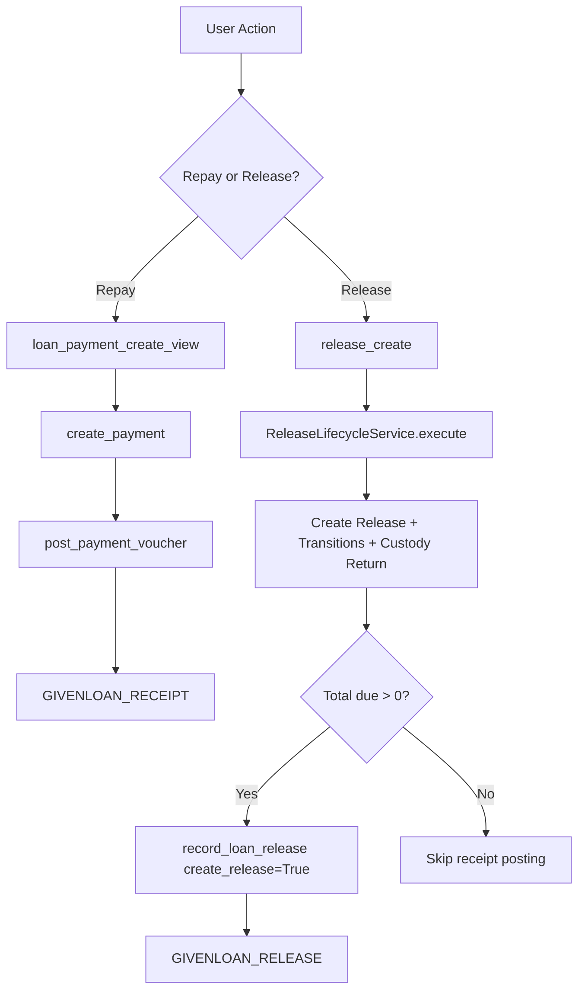

---
status: archived
owner: project
updated: 2026-06-17
tags: [archive]
related: []
---

# Repayment vs Release Event Matrix

This note clarifies the separated lifecycles in Girvi after repayment/release isolation.

## Scope

- GivenLoan repayment flow
- GivenLoan release flow
- DEA voucher classification used by each flow

## Core Rule

- Repayment event posts as GIVENLOAN_RECEIPT.
- Release settlement event posts as GIVENLOAN_RELEASE.
- Repayment path does not create or trigger release.
- Release path owns release creation, custody return, lifecycle transition, and optional release receipt posting.

## Quick Flowchart

## Event Matrix

| User intent | Entry point | Domain write | DEA event created | Voucher classification |
| --- | --- | --- | --- | --- |
| Record repayment | girvi/views/loanpayment.py:loan_payment_create_view | GivenLoanPayment | PaymentVoucher RECEIPT (create_release=False) | GIVENLOAN_RECEIPT |
| Close/release loan | girvi/views/release.py:release_create -> ReleaseLifecycleService.execute | Release + transition + custody updates | PaymentVoucher RECEIPT (create_release=True) when due > 0 | GIVENLOAN_RELEASE |
| Close/release with no due | same release path | Release + transition + custody updates | No receipt is posted | none |

## Why create_release=True Exists

The create_release flag on PaymentVoucher is used as an accounting classification marker for release settlement receipts.

- It is not a UI command in repayment forms.
- It is set by release accounting helper only.

Classification logic:

- PaymentVoucher.get_voucher_type returns GIVENLOAN_RELEASE when:
  - source model is GivenLoan
  - direction is RECEIPT
  - create_release is True

Otherwise GivenLoan receipts classify as GIVENLOAN_RECEIPT.

## End-to-End Behavior

### 1) Repayment (can happen many times)

1. User submits repayment form in loan payment view.
2. Optional catch-up accrual may run (preference controlled).
3. Loan payment record is created with principal/interest split.
4. DEA posting runs and classifies as GIVENLOAN_RECEIPT.

Notes:

- Repayment is repeatable.
- Validation should prevent over-collection beyond due amount.
- Repayment no longer branches into release creation.

### 2) Release (single lifecycle action)

1. User submits release form.
2. ReleaseLifecycleService.preview checks status/transition eligibility.
3. In execute(), within one transaction:
   - optional catch-up accrual before release
   - Release document creation
   - custody return from vault/lender to customer
   - lifecycle transition (request_closure/complete_closure or deliver)
   - release accounting via record_loan_release
4. record_loan_release computes total due (outstanding principal + interest due):
   - if total due > 0: posts receipt with create_release=True -> GIVENLOAN_RELEASE
   - if total due <= 0: skips posting and release still completes

## Practical Examples

### Example A: Partial repayment

- Loan due is 10,000.
- User repays 2,000.
- System posts GIVENLOAN_RECEIPT.
- Loan remains active.

### Example B: Final release with due amount

- Loan outstanding principal is 8,000 and interest due is 500.
- User initiates release.
- System creates release and posts one release settlement receipt for 8,500.
- Voucher type is GIVENLOAN_RELEASE.

### Example C: Release with zero due

- Loan has no remaining due.
- User initiates release.
- System creates release and completes transitions/custody changes.
- No receipt is posted.

## References

- apps/tenant_apps/girvi/views/loanpayment.py
- apps/tenant_apps/girvi/views/release.py
- apps/tenant_apps/girvi/service_modules/release_lifecycle.py
- apps/tenant_apps/girvi/service_modules/payment.py
- apps/tenant_apps/dea/models/payment.py
- apps/tenant_apps/dea/facade.py

