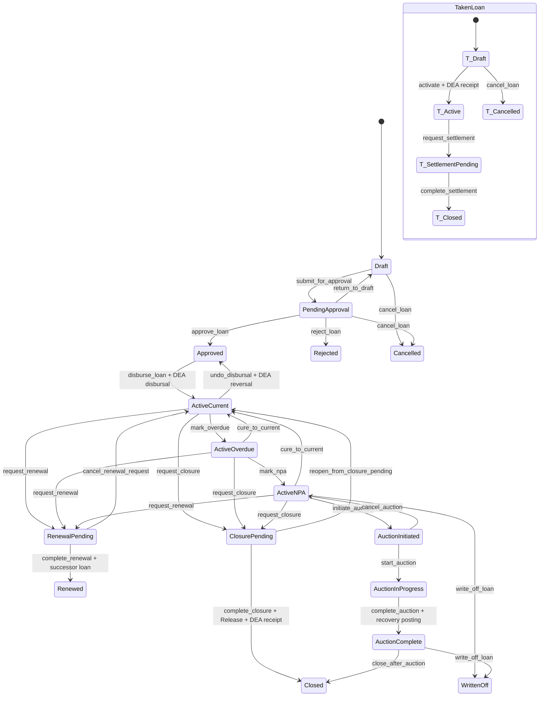

# Girvi Deep Analysis

## Executive Summary

Girvi is a large pledged-loan module in the middle of a successful but incomplete migration. The active runtime has moved from the legacy `Loan` / `LoanPayment` model pair to `GivenLoan`, `TakenLoan`, DEA `PaymentVoucher`, canonical lifecycle flows, service-backed creation, repayment, release, renewal, and selector-backed detail reads. That direction is correct for the MVP, but the app still carries compatibility routes, legacy model surfaces, mixed workflow entry points, and several logical gaps that can create confusing financial state.

Top risks:

| Rank | Severity | Finding | Evidence |
| --- | --- | --- | --- |
| 1 | Critical | Release can create `Release` and close lifecycle while item custody release failures are swallowed per item. | `apps/tenant_apps/girvi/service_modules/release_lifecycle.py:163-171` |
| 2 | Critical | Repayment and taken-loan repayment can save a payment even when DEA posting fails, leaving operational payment state and accounting state divergent. | `service_modules/repayment.py:63-81`, `service_modules/repayment.py:129-156` |
| 3 | High | Outstanding principal subtracts total receipts, not principal-only receipts, so interest collections can reduce displayed principal. | `models/loan_refactored.py:821-846` |
| 4 | High | Loan item edits are not blocked after disbursal/approval; only delete blocks released loans, and the save-time release guard is commented. | `models/loan_item.py:92-104`, `views/loanitem.py`, `forms.py:667-698` |
| 5 | High | Several lifecycle states exist but are not exposed in the generic transition view; overdue, cure, auction start/complete, closure complete, settlement complete are mostly service/system-only or unreachable through standard UI. | `transition_registry.py`, `flows.py`, `views/loan.py:76-99` |
| 6 | Medium | Interest month calculation counts only completed calendar-month deltas and does not encode business policy for minimum month, partial month, grace days, or day-count basis. | `services.py:267-279`, `service_modules/accrual.py:189-216` |
| 7 | Medium | Permission enforcement is inconsistent: many views require login only, while state transitions rely on flow permissions and some admin/template paths do workspace role checks. | `views/*.py`, `flows.py:93-100`, `views/template.py:24-48` |
| 8 | Medium | Auction and sale recovery are represented as lifecycle/payment actions, not durable auction/sale business documents. | `transitions/commands.py:172-260`, `service_modules/loan_posting.py:107-167` |

The practical MVP direction is to keep the current `GivenLoan` / `TakenLoan` split, treat `flows.py` as the lifecycle source of truth, keep synchronous DEA posting for now through `integrations/dea_adapter.py`, and aggressively simplify around command services, selectors, and durable source documents for release, renewal, custody, notice, auction, and sale.

## Current App Structure

Primary source map:

| Area | Files | Responsibility |
| --- | --- | --- |
| Runtime loan models | `apps/tenant_apps/girvi/models/loan_refactored.py` | `BaseLoan`, `GivenLoan`, `TakenLoan`, lifecycle enums, calculated balances, DEA payment generic relations. |
| Legacy loan models | `apps/tenant_apps/girvi/models/loan.py`, `models/legacy.py`, `resources.py` | Historical compatibility for old `Loan`, `LoanPayment`, import/export, migrations. Not target runtime. |
| Collateral and custody | `models/loan_item.py`, `models/custody_tracking.py`, `service_modules/custody.py`, `views/custody_views.py` | Pledged item details, item pictures, storage boxes, repledge/return custody state, `RepledgeHistory`. |
| Lifecycle | `flows.py`, `lifecycle.py`, `transition_registry.py`, `transitions/commands.py`, `transitions/payloads.py`, `service_modules/transitions.py` | Canonical state machine, transition aliases, transition form/payload/command wiring, side effects. |
| Creation/update/list/detail | `views/loan.py`, `forms.py`, `selectors.py`, `tables.py`, `filters.py` | Loan CRUD, creation preview, list filters, detail tabs, read models, bulk merge/delete orchestration. |
| Payments/accounting | `service_modules/payment.py`, `loan_posting.py`, `repayment.py`, `payment_voucher_creation.py`, `integrations/dea_adapter.py` | Synchronous DEA `PaymentVoucher` creation/posting, disbursal, repayment, release, auction/sale recovery, accrual posting. |
| Interest accrual | `models/accrual.py`, `service_modules/accrual.py`, `management/commands/accrue_loan_interest.py`, `tasks.py` | Persistent monthly accrual rows and optional DEA posting. |
| Release/renewal | `models/release.py`, `models/renewal.py`, `views/release.py`, `service_modules/release_lifecycle.py`, `service_modules/renewal.py` | Closure document, release workflow, bulk release, successor loan creation and audit. |
| Notices/printing | `views/notice.py`, `views/prints.py`, `documents/loan_ticket.py`, `documents/release_forms.py`, `models/template.py`, `service_modules/printing.py`, `templates/girvi/template/` | Reminder/notice output, loan ticket PDF, configurable print templates. |
| Compliance/setup | `models/license.py`, `views/license.py`, `views/series.py`, `admin.py` | License, license documents, series, numbering, deactivation guardrails, admin setup. |
| Statements/storage | `models/statement.py`, `views/statement.py`, `views/storagebox.py`, `templates/girvi/statement/`, `templates/girvi/storagebox/` | Physical collateral verification sessions and storage range management. |
| Reports/exports | `views/reports.py`, `views/prints.py`, `facade.py`, `selectors.py` | Loan reports, ledger/export files, cross-app read summaries. |
| Tests | `apps/tenant_apps/girvi/tests/` | Focused coverage for lifecycle matrix, posting adapter, creation, repayment, release, custody, templates, guardrails. |

Related app dependencies:

| App | Current Girvi dependency |
| --- | --- |
| `dea` | Current accounting posting/read boundary through `apps.tenant_apps.girvi.integrations.dea_adapter`, which wraps DEA facade calls (`integrations/dea_adapter.py:24-121`). |
| `party` | Party-first borrower create UI, with `Customer` bridge still populated (`forms.py:447-478`, `views/loan.py`, `models/loan_refactored.py:576-584`). |
| `contact` | `Customer` remains runtime FK for borrower/lender and release recipient (`models/loan_refactored.py:569-584`, `models/loan_refactored.py:875-890`, `models/release.py:36-43`). |
| `rates` / commodity rates | `RateCacheService` reads latest `Rate` by metal and returns `None` or zero depending call path (`services.py:195-249`). |
| `product` | `LoanItem.item` links to `ProductVariant` (`models/loan_item.py:24-26`). |
| `notify` / `notify_v2` | Legacy and newer notice flows are both present (`views/notice.py`, `views/prints.py`, `transitions/commands.py:141-156`). |
| `orgs` | Permissions use workspace membership in flow permission checks (`flows.py:93-100`), but many views only require login. |

## Domain Model Explanation

### Loan

`BaseLoan` is abstract and supplies audit fields, `loan_id`, `series`, `loan_date`, `tenure`, `status`, and `interest_type` (`models/loan_refactored.py:121-180`). It also supplies common calculated helpers:

- `loan_id`: globally unique formatted ID (`models/loan_refactored.py:145-151`).
- `series`: required numbering/license container (`models/loan_refactored.py:153-159`).
- `loan_date`: document date and interest start (`models/loan_refactored.py:161-164`).
- `tenure`: months, currently informational for many workflows (`models/loan_refactored.py:165`).
- `status`: concrete models override this to canonical choices (`models/loan_refactored.py:167-180`, `522-528`, `868-873`).
- `interest_due()`: monthly interest calculation using completed month count (`models/loan_refactored.py:294-307`).
- `total_due`: principal plus computed interest (`models/loan_refactored.py:309-317`).
- `get_total_*payments()`: sums DEA `PaymentVoucher` values, falling back to legacy payment relations (`models/loan_refactored.py:319-360`).

`GivenLoan` is the pawn loan given to a borrower. It owns borrower links, series, DEA payment relation, item aggregation, release relation, split/merge wrappers, and payment wrapper methods (`models/loan_refactored.py:522-850`).

Important fields:

- `borrower`: legacy/current `Customer` FK (`models/loan_refactored.py:569-575`).
- `borrower_party`: nullable Party shadow FK (`models/loan_refactored.py:576-584`).
- `payments`: generic relation to DEA `PaymentVoucher` (`models/loan_refactored.py:595-601`).
- `status`: `LoanLifecycleState`.

`TakenLoan` is money borrowed from a lender against repledged collateral. It uses `lender`, `lender_party`, optional `original_loan`, DEA payment relation, and `RepledgeHistory`-based computed values (`models/loan_refactored.py:853-1085`).

### Collateral / Pledged Items

`LoanItem` is pledged collateral for a `GivenLoan` (`models/loan_item.py:20-42`).

Important fields:

- `loan`: FK to `GivenLoan`.
- `item`: optional `ProductVariant`.
- `itemtype`: metal type.
- `quantity`, `weight`, `purity`: valuation basis.
- `loanamount`: principal allocated to this item.
- `interestrate`: per-item monthly rate.
- `interest`: precomputed monthly interest, set on save (`models/loan_item.py:92-98`).
- `itemdesc`: user-facing item description.

`LoanItemWithCustody` adds custody state, active repledge target, repledged amount, and history helpers. It validates consistency in `clean()` (`models/custody_tracking.py:254-274`) and moves items through `repledge_to()`, `return_from_lender()`, and `release_to_customer()`.

`RepledgeHistory` is the durable audit trail for each repledge/return event. `TakenLoan` current amount, weight, interest, and value read from this history rather than the legacy `RepledgedLoanItem`.

`RepledgedLoanItem` is now compatibility data only (`models/loan_item.py:123-165`).

### Interest

Interest exists in three layers:

| Layer | Current representation |
| --- | --- |
| Base monthly item interest | `LoanItem.interest = interestrate / 100 * loanamount` on save (`models/loan_item.py:92-98`). |
| Calculated due | `BaseLoan.interest_due()` multiplies `get_interest_amount` by completed months (`models/loan_refactored.py:294-307`). |
| Posted/accrual audit | `LoanInterestAccrual` rows per loan/period with optional DEA `JournalEntryVoucher` link (`models/accrual.py:26-105`). |

### Payments / Repayments

Active payments are DEA `PaymentVoucher` rows linked through generic relations (`models/loan_refactored.py:595-601`, `910-916`). Girvi creates them through wrappers and services:

- Disbursal: `record_loan_disbursal()` (`service_modules/payment.py:19-59`).
- Given repayment: `GivenLoanRepaymentService` and `GivenLoanPostingService` (`service_modules/repayment.py:54-81`, `loan_posting.py:20-69`).
- Taken repayment: `TakenLoanRepaymentService` (`service_modules/repayment.py:120-156`).
- Release receipt: `ReleaseLifecycleService` -> `record_loan_release()` (`release_lifecycle.py:208`, `payment.py:84-86`).

### Renewal

`LoanRenewal` links a source `GivenLoan` to a successor `GivenLoan`, with mode, renewal date, interest/principal paid, requested extra amount, user, and notes (`models/renewal.py:14-84`). `LoanRenewalService` creates the successor, clones/scales items, transitions source to renewed, and posts successor disbursal.

### Release

`Release` is a one-to-one closure document for `GivenLoan`, with `release_id`, `release_date`, `created_by`, `released_by`, and `loan` (`models/release.py:21-47`). `Release.save()` generates a release ID and requires `created_by` on create (`models/release.py:62-71`).

### Notices

Notice workflow is split between old `notify`, newer `notify_v2`, print views, and transition side effects. Auction initiation tries to create a loan auction notice through `apps.tenant_apps.notify.services.create_loan_auction_notice` and logs failures without blocking the transition (`transitions/commands.py:141-156`).

### Auction / Sale

Auction/sale currently exists as transition/payment behavior, not durable domain models:

- `initiate_auction`, `start_auction`, `complete_auction`, `close_after_auction`, `write_off_loan` are states/transitions in `flows.py`.
- Recovery posting is `GivenLoanPostingService.post_auction_recovery()` and `post_sale_recovery()` (`loan_posting.py:107-167`).
- `mark_sold` is compatibility-only metadata in `transition_registry.py`, while canonical sale is not fully modeled.

### Customer Relationship

`Customer` is still the concrete FK for borrower/lender/released-by. Party is the long-term model and is partially present through `borrower_party` and `lender_party`. `GivenLoan.save()` and `TakenLoan.save()` backfill Party from bridged Customer when missing (`models/loan_refactored.py:624-632`, `939-947`).

### Accounting Links

Current runtime uses synchronous DEA facade calls through `integrations/dea_adapter.py`. The outbox contract exists but is not the active posting runtime (`integrations/dea_adapter.py:12-21`, `45-77`). `LoanInterestAccrual` has a direct optional link to `dea.JournalEntryVoucher` (`models/accrual.py:69-76`).

### Duplicate / Unclear / Legacy Areas

- `loan_id` is globally unique in `BaseLoan` and also unique per series in concrete constraints; the global uniqueness makes same formatted IDs impossible across `GivenLoan` and `TakenLoan` if they share a table-level constraint per concrete model is not cross-model. Manual form validation checks both concrete models (`forms.py:508-517`), but database cannot enforce cross-table uniqueness.
- `LoanItem.is_available_for_repledge` is defined both through custody mixin semantics and in `LoanItem` itself (`models/loan_item.py:118-120`), which may bypass richer custody checks.
- `ReleaseForm.save()` comment says release accounting is handled by `Release.save()` hook, but current code posts in `ReleaseLifecycleService.execute()` (`forms.py:916-926`, `release_lifecycle.py:208`). The comment is stale.
- Compatibility routes duplicate canonical routes in `urls.py`, especially transition, statement, storage boxes, and reports.

## Loan Lifecycle

## Transition Table

| From | To | Trigger | Preconditions | Side effects | Validation required | Files/functions |
| --- | --- | --- | --- | --- | --- | --- |
| Draft | PendingApproval | `submit_for_approval` | Borrower, collateral, amount > 0 | Status + `LoanChangeLog` | Collateral exists; borrower exists | `flows.py:173-423`, `transition_registry.py`, `service_modules/transitions.py` |
| PendingApproval | Draft | `return_to_draft` | Approver permission | Status + audit | Reason should be captured; form disabled in generic view | `flows.py`, `transition_registry.py` |
| PendingApproval | Approved | `approve_loan` | Approver permission; valid loan | Status + audit | Freeze commercial edits after this | `flows.py`, `forms.py:1164` |
| PendingApproval | Rejected | `reject_loan` | Approver permission | Terminal non-active state | Reason required | `flows.py`, `forms.py:1482` |
| Draft/PendingApproval | Cancelled | `cancel_loan` | Cancel permission | Terminal non-active state | Reason required; no posted voucher should exist | `flows.py`, `forms.py:1268` |
| Approved | ActiveCurrent | `disburse_loan` | Disburse permission | Posts DEA payment voucher with marker `DISBURSAL-GIVENLOAN-<pk>` | Borrower account mapping; no duplicate post | `transitions/commands.py:67-123`, `payment.py:19-59` |
| ActiveCurrent | Approved | `undo_disbursal` | Disburse permission | Reverses disbursal voucher | No other posted payments | `payment.py:89-109`, `transitions/commands.py` |
| ActiveCurrent | ActiveOverdue | `mark_overdue` | None in flow | Status only | DPD/tenure policy missing | `flows.py`, registry disabled in view |
| ActiveOverdue/ActiveNPA | ActiveCurrent | `cure_to_current` | None in flow | Status only | Actual dues/currentness check missing | `flows.py`, registry disabled in view |
| ActiveOverdue | ActiveNPA | `mark_npa` | Default permission | Status + warning | DPD/NPA rule missing | `flows.py`, `forms.py:1508` |
| ActiveCurrent/Overdue/NPA | ClosurePending | `request_closure` | Release permission; outstanding <= 0 unless exception | Status + audit | Balance, custody, release eligibility | `flows.py`, `release_lifecycle.py:53-111` |
| ClosurePending | Closed | `complete_closure` | Release document exists | Release doc, item custody, DEA receipt, status | All items returned/released; no swallowed errors | `release_lifecycle.py:114-230` |
| ClosurePending | ActiveCurrent | `reopen_from_closure_pending` | Release permission | Status only | Undo partial release artifacts | `flows.py`, registry disabled in view |
| ActiveCurrent/Overdue/NPA | RenewalPending | `request_renewal` | Release permission; collateral exists | Status + audit | Renewal mode and dues | `flows.py`, `service_modules/renewal.py` |
| RenewalPending | Renewed | `complete_renewal` | Successor link exists | New loan, cloned items, source closed as renewed, DEA postings | Atomicity and source immutability | `models/renewal.py`, `service_modules/renewal.py` |
| ActiveNPA | AuctionInitiated | `initiate_auction` | Auction permission | Status; optional notice | Notice failure policy | `transitions/commands.py:138-169` |
| AuctionInitiated | AuctionInProgress | `start_auction` | Auction permission | Status only | Auction event/doc missing | `flows.py`, registry disabled in view |
| AuctionInProgress | AuctionComplete | `complete_auction` | Recovery amount supplied | Recovery receipt posted | Recovery amount validation; collateral disposition | `transitions/commands.py:172-235` |
| AuctionComplete | Closed | `close_after_auction` | Outstanding cleared | Status | Outstanding calculation must reflect recovery | `flows.py` |
| ActiveNPA/AuctionComplete | WrittenOff | `write_off_loan` | Default permission | Status; intended accounting impact | Write-off posting incomplete/needs verification | `flows.py`, `transition_registry.py` |
| Taken Draft | Taken Active | `activate` | Disburse permission | DEA receipt from lender | Lender account mapping | `flows.py:424-495`, `payment.py:19-59` |
| Taken Active | SettlementPending | `request_settlement` | None in flow | Status only | Repayment/collateral return check missing | `flows.py` |
| Taken SettlementPending | Closed | `complete_settlement` | None in flow | Status only | Ensure all lender dues paid and collateral returned | `flows.py` |

## Operation-by-Operation Analysis

| Operation | Current implementation | Gaps |
| --- | --- | --- |
| Create loan | Party-first `LoanCreateForm`; service creates `GivenLoan` + initial `LoanItem` atomically (`creation.py:281-333`). | Creation preview can call `LoanIDGenerator.generate()` and consume a lock but does not reserve ID (`creation.py:223-229`). Need clearer manual ID/import policy. |
| Edit loan | `loan_update` reuses old form flow for `GivenLoan` (`views/loan.py:518-585`). | No strong immutability boundary after approval/disbursal. |
| Add collateral item | `LoanItemForm` validates rate and value (`forms.py:599-698`). | Model save does not block released/posted/active loan edits (`models/loan_item.py:92-98`). Form only checks release via hidden `loan` clean path. |
| Calculate eligible amount | Form compares item value against loan amount using current metal rate (`forms.py:684-696`). | No configurable LTV/haircut enforcement in form despite preferences existing; `RateCacheService.get_rate()` can return zero for non-form paths (`services.py:206-218`). |
| Disburse loan | Transition command posts DEA voucher in same transaction (`commands.py:77-91`). | Current synchronous posting contradicts target ADR but is accepted runtime. Need posting-pending state if outbox resumes. |
| Accrue interest | `InterestAccrualService` creates monthly rows and can post to DEA (`accrual.py:142-280`). | Business month policy is incomplete; no minimum interest/grace/day-count configuration. |
| Partial repayment | Given repayment service posts a receipt voucher (`repayment.py:54-81`). | No overpayment check against total due; failure can leave payment saved but unposted. |
| Full repayment | Boolean `is_final_payment` is accepted in forms (`forms.py:1700-1704`, `1756-1760`). | It does not itself close the lifecycle; release remains separate. |
| Renew loan | `LoanRenewalService` creates successor and renewal audit. | Needs stricter source immutability and documented accounting split between interest paid, principal carried, and top-up. |
| Release pledged items | `ReleaseLifecycleService` creates release, moves custody, transitions closure, posts receipt (`release_lifecycle.py:114-230`). | Critical: custody errors are swallowed; release can proceed with unreleased items. |
| Cancel loan | Flow supports Draft/PendingApproval cancel with reason. | No global guard against cancelling loans that have posted accounting through non-standard paths. |
| Mark overdue | Flow state exists. | No scheduled DPD engine and no generic UI form exposure. |
| Send notice | Legacy/new notice paths exist; auction transition can trigger notice. | Notice lifecycle is not a durable first-class loan event; failed notice creation does not block or surface strongly. |
| Move to auction | Flow supports initiation/start. | Missing durable auction case/document, reserve price, notice dates, approvals, bidders, expenses. |
| Sell collateral | Sale recovery posting exists as compatibility command. | No `CollateralSale` document; unclear state mapping separate from auction complete. |
| Close loan | Closure via release or auction close. | Taken loan closure lacks repayment/collateral validation in flow. |
| Generate receipt/report/PDF | Print/template/report modules exist. | Large print/report surface remains partly legacy and should be reduced after MVP routes are chosen. |
| Post to accounting | Synchronous DEA adapter boundary (`dea_adapter.py:24-121`). | Need reconciliation report for loan status vs voucher/journal state; async outbox paused. |

## Logical Gaps

| Severity | Gap | Evidence | Recommendation |
| --- | --- | --- | --- |
| Critical | Release swallows custody exceptions and still closes/posts. | `release_lifecycle.py:163-171` | Fail release if any item cannot move to customer; return item-level errors. |
| Critical | Payment saved but accounting post failed is treated as warning. | `repayment.py:63-81`, `129-156` | For MVP, make repayment atomic with posting or introduce explicit `posting_failed` operational state and reconciliation UI. |
| High | Principal balance calculation subtracts total receipts, including interest. | `models/loan_refactored.py:821-846` | Use `principal_amount` sums for principal, interest sums for interest. |
| High | Item mutation guard is incomplete. | `models/loan_item.py:92-104` | Block item add/edit/delete after approval/disbursal unless through correction/reversal workflow. |
| High | Closure request uses `total_due - get_total_payments()` style fallback in flow; this can mismatch principal/interest accounting. | `flows.py` `_outstanding_amount`, `models/loan_refactored.py:319-360` | Centralize settlement read model in selectors/services and use it for closure and UI. |
| Medium | Interest months ignore partial months. | `services.py:271-279` | Define explicit policy: completed months only, min one month, daily prorata, grace days. Then test it. |
| Medium | Missing DB constraints for positive item values. | `models/loan_item.py:30-38` | Add check constraints for weight > 0, quantity > 0, purity > 0, loanamount > 0, interestrate >= 0. |
| Medium | Cross-table loan ID uniqueness is form/service-only. | `forms.py:508-517`, `models/loan_refactored.py:145-151` | Either accept per-model uniqueness with series scopes or add a shared sequence/registry table. |
| Medium | Permission model inconsistent across views. | `views/*.py`, `flows.py:93-100` | Add policy layer and apply it to create/edit/delete/payment/release/custody/report actions. |
| Medium | TakenLoan closure validates no dues/collateral return only weakly. | `flows.py:424-495` | Add `can_close()` checks to transition command and UI. |
| Low | Stale comments and mojibake in transition UI metadata reduce maintainability. | `forms.py:923-925`, `transition_registry.py` | Clean comments and icon encoding during UI cleanup. |

## Functional Gaps

- Required validations: positive DB constraints, status-aware edit restrictions, overpayment guards, closure settlement validator, taken-loan settlement validator, rate-source required checks outside forms.
- Missing screens: operational overdue queue, NPA queue, auction case page, sale page, posting reconciliation page, payment failure queue, customer loan statement page.
- Missing reports: outstanding principal/interest aging, due date/DPD, collateral in vault vs with lender vs released, loan-to-value exception report, loan/accounting mismatch report.
- Missing admin tools: controlled reversal/correction workflow, posting retry/reconciliation, bulk DPD update, rate setup health.
- Missing tests: post-failure repayment behavior, release item custody failure, item edit after approval/disbursal, overpayment, cross-model loan ID race, taken-loan settlement with unrecovered collateral.
- Missing document generation: durable release receipt, auction notice history, sale memo, renewal agreement, payment receipt tied to voucher.
- Missing audit logs: business event timeline separate from legacy `LoanChangeLog`, including payments, notices, custody moves, reversals.
- Missing reversal/correction flow: disbursal reversal exists; release undo and broader correction workflow are compatibility-heavy and need target UX.

## Over-Engineered or Legacy Areas

| Area | Finding | MVP direction |
| --- | --- | --- |
| Transition registry | It contains canonical, disabled, and compatibility-only entries. Useful but hard to reason about. | Keep one canonical matrix and one explicit legacy alias map; remove dead form metadata when aliases retire. |
| Routes | Many routes include duplicate aliases or old names. | Keep aliases temporarily, document deprecation, then remove after bookmark/import compatibility window. |
| Services aggregator | `services.py` re-exports many services and still contains helpers. | Move helpers into focused modules and make imports explicit. |
| Legacy loan/payment models | Necessary for import/history but dangerous if broadly imported. | Continue guardrail tests; expose only through `models.legacy` and resources. |
| Printing | Large legacy PDF/helper surface plus new template service. | Pick MVP print surfaces: loan ticket, receipt, release form, notice. Archive unused print paths. |
| Notices | Legacy `notify` and `notify_v2` coexist. | Use `notify_v2` for batch reminders; keep legacy route as compatibility redirect or labeled legacy page. |

## Architecture Improvement Plan

Target shape:

| Layer | What belongs there |
| --- | --- |
| `models/` | Durable state only: loans, items, custody history, release, renewal, accrual, auction/sale docs, templates, statements. Avoid posting side effects. |
| `selectors.py` / `selectors/` | Loan detail read model, settlement balance, overdue queues, customer history, accounting reconciliation. |
| `services/` | Use-case commands: create, amend draft, disburse, repay, release, renew, repledge, return collateral, auction, sell, write off. |
| `workflows.py` or `state_machine.py` | Canonical lifecycle transitions and transition policies. |
| `forms.py` | Input shape and local validation only. No accounting or cross-workflow decisions. |
| `views/` | Request/response, messages, redirects, HTMX partials. |
| `policies.py` | Role/workspace/action permission checks and status editability checks. |
| `accounting_adapter.py` | Current sync DEA adapter and future outbox event publisher behind one interface. |
| `reports.py` | Report query specs and export builders. |
| `tests/` | Workflow/service tests first; view tests only for routing/HTMX behavior. |

Specific moves:

- Move settlement calculation out of model properties into a selector/service read model.
- Move item editability into a policy used by forms, views, and service commands.
- Make release, repayment, renewal, disbursal, auction, sale commands return structured results with accounting state.
- Add `AuctionCase` and `CollateralSale` before expanding recovery workflows.
- Keep `integrations/dea_adapter.py` as the only current DEA boundary until event-driven posting resumes.

## Workflow and UI Improvement Plan

Recommended navigation:

| Page | Purpose |
| --- | --- |
| Loans Dashboard | Action queue: drafts, pending approval, due/overdue, release-ready, posting failures. |
| Loans | Tabs for Given, Taken, All; filters saved for active, overdue, NPA, closure pending. |
| New Loan | Party select, collateral rows, valuation preview, terms, save draft, submit for approval. |
| Loan Detail | Header status, financial summary, collateral summary, primary next action, tabs: Payments, Collateral, Custody, Accounting, Notices, Documents, Timeline. |
| Repayment | Shows outstanding split, suggested interest/principal split, overpayment warning, posting result. |
| Renewal | Source loan settlement, new terms, carried principal, paid interest, top-up, successor preview. |
| Release | Mandatory settlement and custody checklist before final submit. |
| Overdue/NPA | Queue with bulk notice generation, mark overdue/NPA actions, cure action. |
| Auction/Sale | Case workflow with notices, valuation, reserve, sale proceeds, expenses, recovery posting. |
| Customer/Party Loan History | All loans, repayments, releases, notices, outstanding exposure. |
| Reports | Aging, collateral inventory, accounting reconciliation, rates/valuation exceptions. |

UI simplification:

- Do not expose raw legacy status values.
- Hide disabled/system transitions from normal users but surface automated state explanations.
- Replace generic transition forms for major workflows with workflow-specific pages: repayment, release, renewal, auction/sale.
- Add visible accounting state: posted, pending, failed, reversed.

## Risk-Ranked Action Plan

| Priority | Task |
| --- | --- |
| P0 | Fix release custody error swallowing and add tests for item release failure. |
| P0 | Decide repayment posting failure policy: fully atomic or explicit failed-posting state. Add reconciliation UI/test. |
| P1 | Correct principal/interest outstanding calculations and closure checks. |
| P1 | Add item editability policy after approval/disbursal and tests. |
| P1 | Add overpayment validation and final-payment behavior definition. |
| P2 | Define interest month/day policy and update accrual/unit tests. |
| P2 | Add durable auction/sale documents before expanding auction recovery UI. |
| P2 | Centralize permission policies for create/edit/delete/payment/release/custody/report. |
| P3 | Retire duplicate routes and stale transition aliases after compatibility matrix sign-off. |
| P3 | Consolidate print/notice surfaces to MVP set. |

## Suggested Test Plan

Workflow tests:

- Create loan with valid Party bridge and collateral.
- Reject/cancel before disbursal with reason.
- Disburse posts one voucher and repeated submit is idempotent.
- Repayment splits principal/interest correctly and prevents overpayment.
- Repayment posting failure either rolls back payment or records failed state.
- Release blocks when outstanding balance remains.
- Release blocks when any item is with lender or cannot move to customer.
- Renewal creates successor and source cannot be edited afterward.
- TakenLoan cannot close while balance remains or collateral is still with lender.
- Auction recovery posts once and cannot close unless balance is settled.

Model/constraint tests:

- Positive item fields.
- Cross-model loan ID duplicate behavior.
- Loan item edit/delete blocked by status.
- Accrual uniqueness and period boundaries.
- Storage box range overlap.

Architecture tests:

- Runtime code does not import legacy `Loan` except allowed files.
- Girvi posting uses `integrations.dea_adapter`.
- Views do not call DEA facade directly.
- Cross-app reads use selectors/facade.

## Suggested Next Codex Tasks

1. Fix release custody failure handling in `ReleaseLifecycleService` and add regression tests.
2. Fix outstanding principal/interest read model and use it in closure/repayment/release screens.
3. Add item editability policy and enforce it in loan item forms/views/services.
4. Add repayment overpayment and posting-failure tests, then choose atomic vs failed-posting behavior.
5. Draft `AuctionCase` / `CollateralSale` MVP model plan before implementing auction UI.
