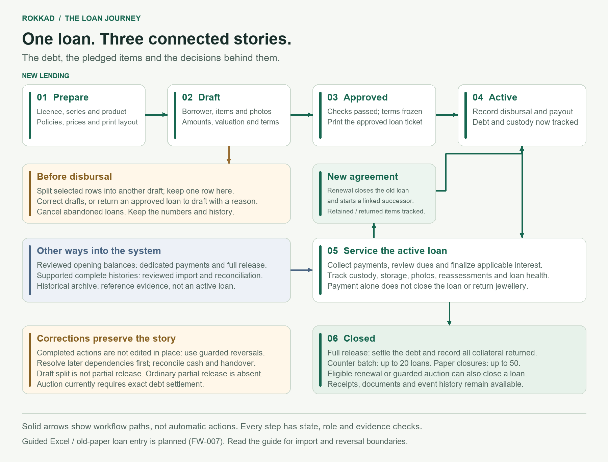

# The loan journey

Rokkad connects borrower debt, physical collateral and staff action history.
This reference describes the implemented system, not a proposed feature list.
The workspace handbook is available at `/w/<workspace-slug>/loans/guide/`, linked
from Loans and loan details. Its source is
[the staff guide template](../../templates/loans/journey.html).

The full-resolution PNG is shared by the repository and workspace guide.
Regenerate it with `python scripts/render_loan_journey.py` (Pillow and Arial or
DejaVu Sans). The [renderer](../../scripts/render_loan_journey.py) is its editable
source. The prose below is the accessible, detailed equivalent of the map.

## 1. The state map

Stored states are `DRAFT`, `APPROVED`, `ACTIVE`, `CANCELLED` and `CLOSED`.
Overdue, partly paid, imported and undercovered describe other dimensions; they
are not additional loan states. Custody has its own state and evidence.

| From | Action | Result and evidence |
|---|---|---|
| New | Create validated draft | DRAFT; licence/series number allocated |
| DRAFT | Edit | Same draft and number; recalculated proposed economics |
| DRAFT | Split selected collateral rows | Source and new numbered destination both DRAFT; at least one row remains; original item identities/photos move |
| DRAFT | Approve | APPROVED; frozen approval evidence and terms |
| APPROVED | Return to draft with reason | DRAFT; prior approval evidence retained |
| DRAFT / APPROVED | Cancel with reason | CANCELLED; number not recycled |
| APPROVED | Disburse | ACTIVE; immutable payout/policy evidence and obligations |
| ACTIVE | Repay / applicable accrual / capitalization | ACTIVE; financial events and balances updated, not automatic handover |
| ACTIVE | Full release | CLOSED; settlement and physical return evidence |
| ACTIVE | Eligible renewal | Source CLOSED; linked successor ACTIVE under new agreement |
| ACTIVE | Supported auction completion | CLOSED after notice/custody/settlement guards |
| ACTIVE | Reverse disbursal, with dependencies resolved | APPROVED; return to draft before correcting and reapproving |
| CLOSED | Eligible release or renewal reversal | Source ACTIVE; renewal successor cancellation and custody follow the specialized service |
| Reviewed import | Opening or supported complete history | ACTIVE or supported historical end state, with source provenance |

Cancellation and reversal are explicit actions. Ordinary operational loan deletion
is not offered. An archived historical source claim is not a `PawnLoan` with a
live receivable.

## 2. Prepare a business, identify a borrower, describe the pledge

Setup connects current licences, loan/release numbering series, active product
versions, economics, metal interest policies, reference buying prices and print
layouts. Starter products are seeded automatically as drafts for review:
`GOLD-BULLET`, `GOLD-INTEREST-BULLET`, `GOLD-FLEXIBLE`, and
`GOLD-INSTALLMENT-EMI`. Products answer when money is due; policies calculate the
terms. Reference metal prices are maintained business quotes, not a live market feed.

Party owns borrower identity. Multiple contacts, addresses and photos have
defaults for everyday identification. Borrower search and loan history reduce
duplicate identification and give staff context.

Collateral rows capture metal, description, quantity, gross/net weight, purity,
appraisal, allocated principal and photographs. Quantity means pieces; weights
and allocations are row totals, never multiplied by quantity again. New rows
default to quantity 1 and purity 75%; historic unknown quantity remains unknown.
Each native loan item needs a photo for approval. Missing borrower photos can
use blank/default presentation. Multiple photos and available camera selection
support capture; ticket space is conserved with selected/default photographs.

Each item resolves an interest rate from policy scope. Authorized loan approvers
can override with a reason; approval freezes both selected and baseline rates.
Gold and silver can have different rates on one loan. The displayed effective
monthly rate reflects the principal allocations. LTV is checked per item.

Example, subject to valuation: INR 80,000 gold at 2% plus INR 20,000 silver at 4%
produces INR 2,400 monthly interest. If one advance month and INR 10 fee are
deducted, the recorded net payout is INR 97,590. Payout, principal and monthly
interest are distinct amounts.

## 3. Draft, approve, print and disburse

Draft split moves whole rows into a new draft; it does not divide a row's piece
quantity, duplicate photographs, or perform a partial release. Both proposed
loans are validated. A fingerprint rejects a stale confirmation. Creation,
movement, recalculation and sequence advancement commit atomically. See the
[split decision](../adr/2026-08-12-pawnloan-draft-collateral-split.md).

The saved draft Overview exposes **Split into another draft** to actors with
`data.edit` and `data.create` when at least two collateral rows exist. One-row
drafts explain how to add separate rows first. The existing More loan actions
and per-item shortcuts remain. Approved/active loans never gain split access.
Transferring a draft away from unavailable/expired licence setup is a separate,
reasoned setup correction, not a general number-editing tool.

Approval validates evidence and freezes terms. Subsequent policy changes do not
retroactively rewrite approved contracts. The ticket can be issued after
approval; its saved official PDF is reprinted byte-for-byte. Original/duplicate
copies and signature spaces do not constitute electronic signing.

Separate approval and disbursal are supported, as is an authorized combined
review/disburse workflow. Combined mode retains both records; it does not promise
mandatory approval by two different people. Disbursal records financial evidence,
cash payout and obligations; it does not initiate a bank transfer.

## 4. Service debt and physical custody

Repayments allocate under the applicable rules to fees, overdue/current interest
and principal. Native interest accrual finalizes applicable completed periods;
capitalization requires the supported compound policy. Keep these read models
distinct: recorded balance, projected/unfinalized interest, contractual dues,
economic exposure, and a current full-settlement quote.

Paying the balance does not establish physical return. A full release records
the payer, recipient and actual handover. Photos, stable item identifiers/labels,
storage transfers and physical verification maintain custody evidence.
Approved reappraisals add valuation versions without changing original terms.

Funding loans are a separate obligation to a funding lender, with eligible
customer items pledged and returned through custody checks. Closing funding
requires settlement and item-return readiness. Do not present funding movements
as ordinary borrower repayments.

## 5. Coverage, overdue status and reporting

**Collateral coverage** compares eligible collateral value with relevant debt
exposure. The exposure basis depends on product family: maturity payoff for
bullet/flexible products, total economic exposure for installment products.
It is not necessarily the original principal or the recorded balance alone.
Valuation uses the frozen method (calculated metal value, approved appraisal, or
lower of both), current permitted evidence freshness and eligible custody.

INR 1,00,000 exposure against INR 1,25,000 eligible value gives 80% LTV.
Against INR 90,000, the full-coverage shortfall is INR 10,000. The policy limit
can be breached before full coverage is lost; 100% coverage and compliant LTV
are different tests.

**Unknown coverage** means a reliable comparison cannot be made. Missing or stale
required prices/appraisals, unavailable monitoring policy, incomplete evidence or
unusable assessment can prevent calculation. It means neither worthless
collateral nor a safe loan. Debt can be known while coverage is unknown. Resolve
the displayed blockers and refresh the assessment; never silently coerce missing
values to zero. Dashboard completeness gates prevent incomplete portfolio totals
from masquerading as complete coverage. Read the specific screen's denominator:
unassessed/stale/error counts are separate from current saved assessments.

Delinquency concerns contractual due dates and unpaid obligations; collateral
risk concerns security value. A fresh assessment can still show a risky loan.
Scheduled refresh requires an operational worker. Notice intent/delivery evidence
does not prove receipt; provider acceptance remains separate from implemented UI.

Reports include borrower filtering, licence/series active totals, origination
years, collateral metal weights and recorded approved appraisal values. Appraisal
report totals are not live market prices or automatically eligible coverage.

## 6. Close, renew, auction or correct

Full release uses a current quote and actual collection. Authorized interest
concessions require a reason; this facility does not waive principal, capitalized
principal or fees. Handovers and settlement commit together with retry guards.

- Counter batch: up to 20 loans under one combined collection.
- Paper closure entry: up to 50 per submission, no daily cap; actual date defaults
  to today and each loan carries actual collection, payer and recipient. The
  defaults must match reality. Selected rows commit together. Quotes expire;
  preview again when necessary. Do not duplicate closures already entered.
- Transition retirement: each owner chooses a system-first date, reconciles the
  earlier backlog, then retires routine paper entry. Authorized exceptions retain
  reasons. Paper closure evidence records the known date without inventing an
  exact handover time.
- Renewal: eligible native loan closes and a linked successor opens, with explicit
  retained/returned/new collateral and settlement/top-up. Current same-business-day
  and capitalized-principal attribution guards still apply.
- Ordinary partial collateral release is not supported. Use full release or an
  eligible renewal with an explicit collateral plan.
- Auction is a guarded native-loan workflow with overdue, custody and prior-notice
  requirements. Current completion requires exact debt settlement; surplus
  distribution and shortfall/write-off accounting are not implemented.

Corrections preserve source events. Disbursal, payment, release and renewal
reversals each check later dependencies. Resolve them in the permitted order;
never edit posted evidence in place. Reversing disbursal does not itself correct
the terms: return to draft, correct, reapprove and disburse again. It retains the
loan number. Cash and physical movement must also be reconciled in the real world.

## 7. Imported history and deliberate digitization

Supported complete-history profiles, reviewed opening balances and historical
archive evidence are distinct admission paths. Openings preserve original terms
and source cutover evidence rather than pretending the loan was just disbursed.
Dedicated payments, full release and their reversals are available for eligible
opening loans. Ordinary native accrual, capitalization, renewal, auction and
partial release are not automatically available. Imported monthly interest
continues on its reviewed original anniversary rules; principal reduction affects
subsequent monthly charges rather than rewriting already-earned interest.

Imported ticket copies identify themselves as reconstructed from imported
records. They combine source financial/collateral evidence with permitted current
presentation details; they do not invent a native approval or original issued PDF.
Archive records are searchable reference evidence, not active balances.

Customers may start new lending in a new series while leaving existing paper
loans outside Rokkad. Then portfolio totals describe the digitized portion only.
Gradually adding old paper loans manually or uploading general Excel loan sheets
requires the planned guided admission/reconciliation workflow. This already exists
as [FW-007](../plans/future-work.md#fw-007-guided-customer-facing-legacy-migration);
it is not shipped. Do not simulate it with new-loan disbursals. Party imports alone
do not import financial loan history.

Strict portability profiles are not universal backups. Some newer evidence,
including date-only paper handovers and collateral metadata, has profile limits;
full database backups retain the database records. See
[collateral portability follow-up](../plans/collateral-portability-metadata.md).

## 8. Implementation map and maintenance

| Concern | Implementation entry points |
|---|---|
| State vocabulary | `domain/vocabulary.py` |
| Drafts, split, numbering | `services/pawn_drafts.py`, `pawn_draft_split.py`, `number_allocation.py` |
| Approval, cancellation, return to draft | `services/pawn_lifecycle.py` |
| Disbursal, snapshots, workflow choice | `services/pawn_disbursal.py`, `loan_workflow.py` |
| Collections and interest | `services/pawn_repayment.py`, `pawn_interest.py`, `opening_servicing.py` |
| Endings and corrections | `services/pawn_release.py`, `pawn_renewals.py`, `pawn_auctions.py`, `pawn_reversal.py`, `paper_closures.py` |
| Physical custody and funding | `services/storage_operations.py`, `physical_verification.py`, `funding_loans.py` |
| Financial/coverage read models | `selectors/exposure.py`, `collateral_valuation.py`, `dashboard_health.py` |
| Guide / draft discoverability | `web/journey.py`, `web/pawn_reads.py`, `templates/loans/journey.html`, `templates/loans/pawn/detail.html` |

Python paths above are relative to `apps/tenant_apps/loans/` unless prefixed with
`templates/`. Services own transitions, views orchestrate, selectors read, and
templates present. Workspace authorization, business-write availability and forced
RLS remain independent boundaries. The guide uses the ordinary read-only Loans
access decorator; it never creates transactions or grants a capability.

Update this reference, the staff template and diagram together when a journey
changes. The landing page uses a deliberately shorter benefit-led story; do not
advertise planned arbitrary loan uploads, automatic bank transfers, guaranteed
message delivery, electronic signatures or regulatory compliance as shipped.

### Further reading

- [Workflow choice](loan-workflow-choice.md)
- [Collateral entry and item interest](collateral-entry-and-interest.md)
- [Correct a disbursed loan](correct-a-disbursed-loan.md)
- [Paper closure transition](paper-closure-transition.md)
- [Loan health](loan-health-monitoring.md)
- [Financial read models](../domain/pawn-loan-financial-read-models.md)
- [Reviewed opening imports](legacy-opening-import.md)
- [Historical archive](historical-loan-archive.md)
- [Loan document printing](loan-document-printing.md)
