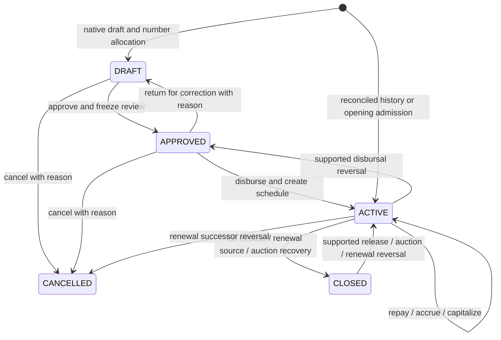
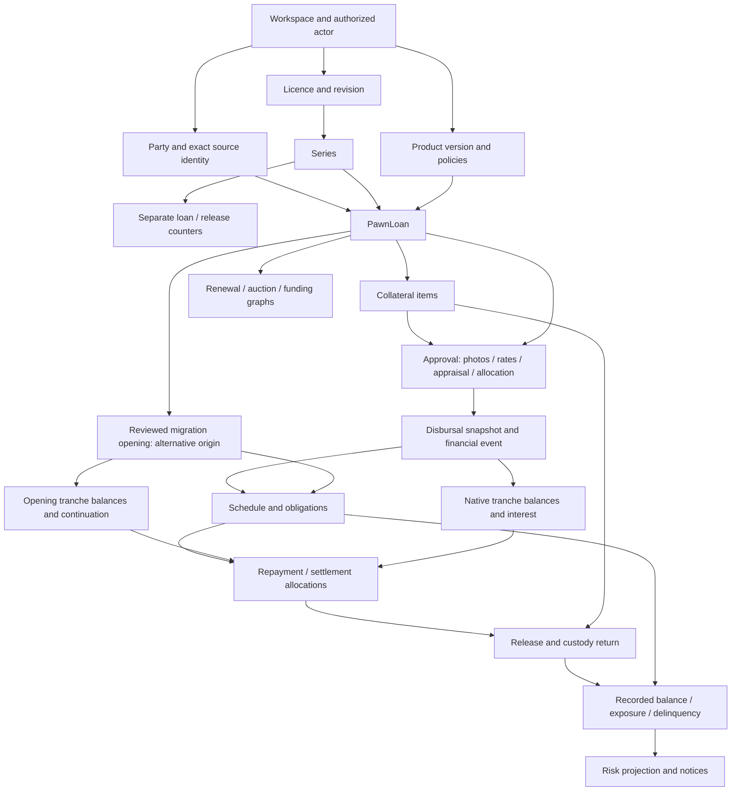

# Loans lifecycle and dependency map

Companion to [the architecture audit](../architecture/loans-portability-audit.md).
This describes current code, including compensating transitions that are not in
the ordinary vocabulary graph. `Released`, `Settled`, `Overdue`, `Imported` and
`Partially paid` are not stored PawnLoan states.

## Business state and compensations

The last three compensation edges are specialized services, not arbitrary reverse
transitions. Complete-history admission can finish CLOSED after restoring an
evidenced full release. A historical claim cannot enter through these edges without
the accepted profile evidence. `can_transition` in
[vocabulary.py](../../apps/tenant_apps/loans/domain/vocabulary.py) is only the ordinary
state map; it is not the full authoritative description of correction workflows.

## Current transition inventory

All mutation rows below also need matching Workspace isolation, a current actor
and the relevant service checks. Action names are current code names. “Append”
means original evidence remains even after compensation. These are operational
requirements; the same resulting state can be a source assertion without proof of
the operation. Only the supported import profiles can presently admit that assertion.

The specialized “administrator” boundary currently resolves the action
`workspace.settings.manage` through `LOANS_ADMIN_ACTION`; it is not a role-name
comparison. This differs from the legacy generic importer flagged in the audit.

| Source → target | Trigger / permission | Preconditions and prior-history assumption | Calculations / side effects / generated evidence | Reversal and historical interpretation |
| --- | --- | --- | --- | --- |
| none → DRAFT | `create_pawn_draft`; data.create | Active Party; usable Workspace licence/series, available active product, tenor, item allocation/economics | Allocate loan number at creation; PawnLoan + items + draft log; optional photo wrapper stores files | Number not reused after committed cancellation. No need to create a fake draft to preserve external existence. |
| DRAFT → APPROVED | `approve_pawn_loan`; loan.approve | Allowed transition; each item full_clean and photograph; positive reconciled item allocation; available valuation; rate-consuming method uses current-date/same-day quote evidence | Freeze versioned approval payload/fingerprint, reviewed appraisals and origination quotes; log state | Return to DRAFT retains prior snapshots. Original historical approval is optional as a source fact in the proposed archive, mandatory in current complete-history profile. |
| APPROVED → DRAFT | `reopen_pawn_loan`; data.edit | Reason, allowed source state | State/log only; subsequent approval creates another version | Historical correction may be known without its UI action. |
| DRAFT or APPROVED → CANCELLED | `cancel_pawn_loan`; data.edit | Reason; not already disbursed ACTIVE | Cancel state and log; no fictional refund/payment | No ordinary reopen. Source “cancelled” must retain the vendor meaning; it is not necessarily this pre-disbursal cancellation. |
| APPROVED → ACTIVE | `disburse_pawn_loan`; loan.disburse | Frozen matching approval; origination quote/date checks; completed retry validates access | Policy snapshot, DISBURSAL event, disbursal snapshot, version-1 schedule/obligations, state/log; gross minus advance interest/fees gives net cash | Disbursal reversal requires unchanged compatible downstream evidence. Original disbursal fact is mandatory only for complete history, not opening admission. |
| DRAFT → ACTIVE (composed) | `review_and_disburse`; owner SIMPLE workflow plus component checks | Signed current review; Workspace SIMPLE mode; current unchanged inputs and quotes | Runs approval and disbursal atomically; both records remain | UI simplification, not a new persistence state. |
| ACTIVE → ACTIVE | `record_pawn_loan_repayment`; loan.repay | Positive precision-valid amount ≤ debt; request key; supported origin | Allocate fees → overdue interest → current interest → principal; principal to tranches; REPAYMENT event, lines, obligation allocations and log | Authorized dependency-aware reversal. Current opening origin denied. An old cash receipt lacking breakdown is source evidence, not a valid current allocation. |
| ACTIVE → ACTIVE | `finalize_pawn_loan_accrual`; loan.accrue | Supported origin, period/policy/tranche evidence | Period calculation, advance coverage deduction, immutable accrual header/lines; recognized events where applicable; log | Preserve effective dates and zero-recognition periods. Native monthly accrual cannot run from original date on an opening. |
| ACTIVE → ACTIVE | `capitalize_pawn_loan_interest`; loan.capitalize | Supported compound policy/interval, available recognized interest and servicing guards | Move interest into capitalized principal via event; maintain original versus capitalized principal | Complete history/opening profiles exclude this. It is not a generic historical balance correction. |
| ACTIVE → CLOSED | `release_pawn_loan_in_full`; loan.release | All remaining collateral; releasable custody; full readiness; cash + explicit interest concession exactly equals required settlement | Native or opening-specific catch-up calculation; RELEASE_RECEIPT, accrual if needed, release number/header/items, closing lines, obligation allocations/termination, custody return, log | Append release reversal restores ACTIVE/custody/schedule and reverses coupled catch-up. Historical release date alone must not fabricate this graph. |
| ACTIVE → unchanged/error | `release_pawn_loan_partially` | Public partial release is unsupported | Raises; no writes | Do not advertise it based only on a partial-readiness selector. Renewal handles retained/returned collateral separately. |
| ACTIVE source → CLOSED; new successor → ACTIVE | `renew_pawn_loan`; loan.release + loan.approve + loan.disburse | Current business date; no successor/open auction; eligible current custody; reviewed retained/returned/new items; product/valuation/settlement/top-up constraints | Source catch-up + settlement/release; successor approval/policy/opening, new loan number, schedule, per-item opening/closing lines, lineage, custody/storage transitions | Coupled reversal requires source CLOSED and successor ACTIVE without incompatible descendants; source ACTIVE, successor CANCELLED. Bare source “renewed” cannot imply all these facts. |
| ACTIVE → ACTIVE; auction none → INITIATED | `initiate_pawn_loan_auction`; administrator boundary | Overdue; proposed auction date after notice date; no open auction; all items in vault; financial origin supported | Auction identity, notice intent, initiation log | No financial closure yet; historical auction notice and sale outcome are separate source facts. |
| Auction INITIATED → IN_PROGRESS | `start_pawn_loan_auction`; administrator | Scheduled date reached; recorded auction notice sent | Progress state/log | Delivery evidence is a prerequisite for this operation, not proof all historical auctions had Rokkad notices. |
| Open auction → CANCELLED | `cancel_pawn_loan_auction`; administrator | Reason; INITIATED or IN_PROGRESS | Auction state/log; loan stays ACTIVE | Does not cancel debt. |
| Auction IN_PROGRESS → COMPLETED; loan ACTIVE → CLOSED | `complete_pawn_loan_auction`; administrator | Buyer; collateral still vaulted; finished periods accrued; exact full-debt recovery | Partial-period catch-up; AUCTION_RECOVERY; allocations/schedule termination, disposal items/custody/storage removal, state/log | No shortfall write-off/surplus distribution currently. Reversal preserves completed evidence. General external auctions often violate this product restriction legitimately. |
| CLOSED → ACTIVE | release/auction reversal; administrator boundary | Original event unreversed; reason; no incompatible later events/custody | REVERSAL plus specialized reversal row, reverse allocations and schedule change, restore custody/state; coupled catch-up reversal | Ordinary vocabulary forbids CLOSED edits; explicit correction services are the exception. |
| ACTIVE → APPROVED | disbursal reversal; administrator | Supported event kind and no prohibited dependents; active loan | REVERSAL and schedule effects; original snapshots retained | Not deletion/recreation and not opening void. |
| none → ACTIVE, optionally CLOSED | `import_complete_history`; owner import/setup + approve/disburse + actions present in source | Exact Party mapping, licence/product compatibility; complete supported timeline and checkpoints | Historical writer constructs supported evidence, reconciling each checkpoint and final obligations/custody; HistoricalLoanImport + audit | No live numbers or source-actor impersonation. Later normal servicing supported; changed re-import conflicts. |
| none → ACTIVE | `commit_opening_import`; owner import/setup | Reconciled v2 review, bound source identity, explicit setup, principal/interest/fees, continuation, obligations/custody | PawnLoan/items, optional reviewed appraisals, policy, MIGRATION_OPENING, remaining schedule, immutable origin/audit | No historical cash/disbursal/approval or old repayments. Only explicitly supported opening servicing enabled. |
| none → ACTIVE/CLOSED | `commit_opening_restore`; owner import/setup plus export/release | Valid bounded opening export, explicit destination references, chronology/hash/semantic reconciliation | Rebuild opening, dated appraisals and release/reversal graph through shared private writers; retain source ancestry | No clock patch/live number consumption; cannot merge into an existing ordinary opening. |

Service references: [pawn_drafts](../../apps/tenant_apps/loans/services/pawn_drafts.py),
[pawn_lifecycle](../../apps/tenant_apps/loans/services/pawn_lifecycle.py),
[pawn_disbursal](../../apps/tenant_apps/loans/services/pawn_disbursal.py),
[pawn_repayment](../../apps/tenant_apps/loans/services/pawn_repayment.py),
[pawn_interest](../../apps/tenant_apps/loans/services/pawn_interest.py),
[pawn_release](../../apps/tenant_apps/loans/services/pawn_release.py),
[pawn_renewals](../../apps/tenant_apps/loans/services/pawn_renewals.py),
[pawn_auctions](../../apps/tenant_apps/loans/services/pawn_auctions.py),
[pawn_reversal](../../apps/tenant_apps/loans/services/pawn_reversal.py),
[loan_workflow](../../apps/tenant_apps/loans/services/loan_workflow.py).

## Dependency graph

The opening branch replaces origination evidence, not referential integrity.
Before an operational loan can exist, the graph still needs Workspace, Party,
licence/revision, series and product/version. A proposed historical archive record
would require Workspace plus source identity/evidence; it need not require a local
Party or operational setup merely to retain an unresolved source reference.

## Quantifying the graph

Static count for the smallest complete-history closed example with one collateral
item, zero interest, same-day disbursal and full release, no fees or catch-up:

| Required new loan-owned row | Count |
| --- | ---: |
| PawnLoan, collateral, approval, policy | 4 |
| DISBURSAL event + disbursal snapshot | 2 |
| Schedule + one obligation | 2 |
| RELEASE_RECEIPT event + principal obligation allocation + principal closing line | 3 |
| Release + release item + custody event | 3 |
| Schedule termination + HistoricalLoanImport | 2 |
| **Core graph total** | **16** |

This excludes one staged LoanHistoryBatch and the import audit, any prior Party
identity rows, and at least six existing dependency rows (Workspace, Party,
licence, revision, series, product version) plus the product header and local actor.
It is a static lower-bound example, not a measured row count from a migration.
Later dates require accrual evidence; multi-item loans and separate payments add
tranche/obligation/return records. The detailed closed test fixture has five
financial events, not merely an asserted closed status.

Smallest one-item unverified opening with one remaining obligation: PawnLoan,
item, policy, opening event, schedule, obligation, HistoricalLoanImport = **7 core
rows**, plus audit and optional staging. A verified appraisal adds one row.
Neither count implies the current writers create false evidence: they require
the relevant input facts. It quantifies why an archive claim must not be routed
through either writer just to become searchable.

## Read model and side-effect order

Recorded debt starts with a supported financial origin and folds effective-dated
events. Tranche readers track item principal; obligation readers track promised
due dates and allocations. Exposure composes recorded and projected amounts.
Delinquency uses unpaid contractual obligations; risk adds valuation/policy/freshness.
These layers must not ingest unreconciled historical assertions as operational debt.

`risk_signals` runs on relevant model saves and invalidates active snapshots inside
the source transaction. Command simulation is safe only while these and audit
writes are transactional; file/provider effects cannot be added to a rolled-back
preview path. Notice delivery is downstream and does not mutate debt. Current
closed-loan monitoring is excluded from active portfolio work; release reversal
reactivates that work. See [financial read models](../domain/pawn-loan-financial-read-models.md).
